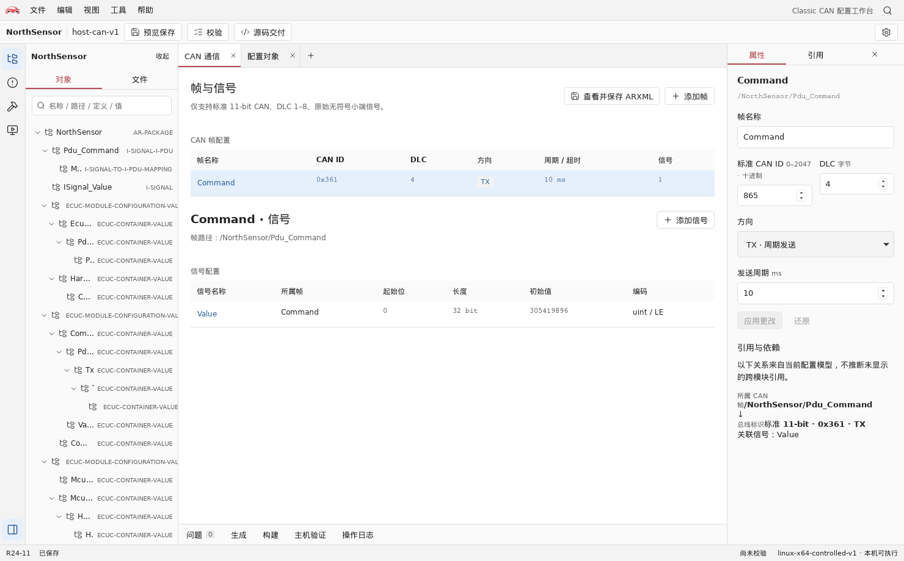
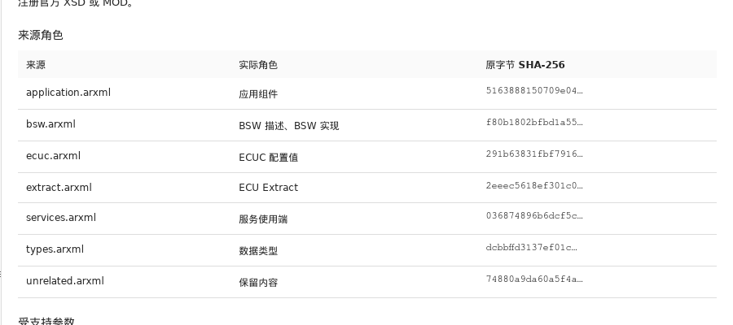
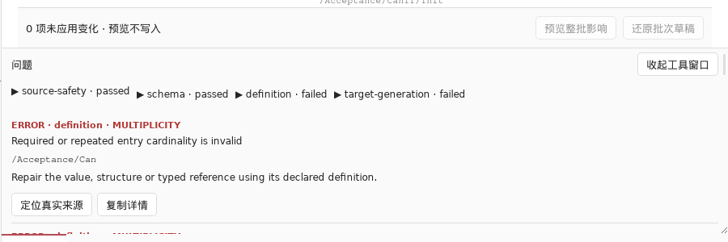

<div align="center">
  
  <h1>Autsaro</h1>
  <p>面向 AUTOSAR Classic 的配置与代码生成工作台</p>
</div>

[功能一览](#功能一览) · [能力范围](#当前支持) · [使用流程](#使用顺序) · [本地开发](#本地开发环境) · [验证](#代码质量检查) · [文档](#文档导航)

Autsaro 支持从内置模板创建 ECU 工程，或导入多份 ARXML；在同一工作区编辑配置、检查引用、预览保存差异，并生成独立 C99 源码工程。当前采用 AUTOSAR Classic R24-11。

日常配置与源码准备不依赖官方 XSD/MOD、编译器或联网；本机预检、构建与主机行为验证需要另外准备声明的工具链。

## 功能一览

<h3> 配置编辑与引用检查</h3>

工程树、帧与信号表、属性检查器共用同一工作区。选择对象后，可检查参数与引用关系，编辑 CAN ID、信号布局和发送周期。

<a href="docs/images/workbench-configuration.png"></a>

<table>
  <tr>
    <td width="50%" valign="top">
      <h3> 多文件工程</h3>
      <p>在同一工程中组织应用、BSW、ECUC 与系统描述，查看各文件的来源角色。</p>
      <a href="docs/images/workbench-files.png"></a>
    </td>
    <td width="50%" valign="top">
      <h3> 校验与问题定位</h3>
      <p>结构、定义与生成约束分别报告；从问题详情定位到对应配置对象。</p>
      <a href="docs/images/workbench-validation.png"></a>
    </td>
  </tr>
</table>

## 当前支持

| 范围 | 支持内容 |
| --- | --- |
| 工程与 ARXML | 多文件导入、跨文件引用、内置模板、项目成员管理与安全保存 |
| 配置编辑 | 对象树、字段与引用检查、批量修改、实例结构编辑 |
| CAN 信号 | 11 位 Classical CAN，DLC 1 至 8；每 ECU 最多 32 帧、64 信号；1 至 32 位无符号 LSB0 小端信号 |
| 主机诊断 | 有限 DoCAN、会话与 DID 服务；部分目标可配置写入、例程、DTC 与主机文件持久化 |
| 源码交付 | BSW、OS、RTE／应用接口、配置、目标依赖与离线构建工具 |

诊断服务与容量随生成目标不同，详见[运行时支持范围](runtime/README.md)。未知配置按覆盖范围保留为只读或限制相应操作；安全保存与目标生成分别检查。

当前运行目标为受控 Windows／Linux 主机环境，不提供真实 MCU、硬实时、功能安全或官方符合性认证。macOS 原生构建与 IPC 尚未验证，不提供本机虚拟 ECU。

## 使用顺序

1. 从内置模板新建工程，打开已有工程，或一次导入同一 ECU 的全部 ARXML。
2. 在工程树中选择对象，检查参数与引用；批量修改先查看整批影响，再应用。
3. 保存前查看文件差异并确认。预览不写磁盘；来源文件被外部修改后须重新导入。
4. 选择工程之外的目录交付源码。需要构建或主机验证时，再配置对应目标的工具链；构建目录与源码目录分开。

未修改的来源文件保留原字节。重复生成会核对文件完整性，旧工程保留为备份，不覆盖用户修改；应用与来源变化会使已有预检、生成确认和下游结果失效。

## 本地开发环境

人和 Agent 共用同一开发流程，不需要 Codex 或 BMad。完整说明见 [贡献指南](CONTRIBUTING.md)。准备 Git、uv 和 Node 24 后，在仓库根目录运行：

~~~sh
uv sync --locked
uv run dev setup --profile ui
uv run dev doctor --profile ui
uv run dev start ui
~~~

浏览器可开发界面和前端逻辑；完整文件操作及 IPC 使用桌面应用。Rust 核心和桌面开发需另准备 [平台依赖与本地配置](docs/development/environment.md)，随后运行 uv run dev start desktop。

推荐版本由 rust-toolchain.toml、.node-version、.python-version 和 ui/package.json 声明，依赖由 Cargo/npm/uv 锁文件固定。正常开发与严格原生验收的版本要求分别说明。官方 XSD/MOD/样例仅用于对应资源测试，不是 UI、内置配置测试或普通应用使用的前置条件。

## 代码质量检查

~~~sh
uv run dev check --scope ui
uv run dev check --scope tooling
uv run dev check --scope core
~~~

检查不重装依赖，实时显示输出并保留日志；按任务选择范围。--plan 预览命令，--json 输出结构化结果，--base 显式指定分支基准，默认 HEAD 检查待提交改动。

基础测试、官方对照、原生运行及 GUI/安装包验收分别执行，见 [测试指南](docs/development/testing.md)。完整资源与原生检查使用 uv run dev check --scope all --full；缺失或未运行的层不显示为通过。

## 构建与分发

在已准备平台依赖的原生宿主上运行：

```sh
npm run tauri --prefix ui -- build
```

产物位于 `src-tauri/target/release/bundle/`。Windows 配置 MSI，Linux 配置 deb／AppImage；macOS 配置 app／dmg，但尚未完成原生验证。签名、公证与公开发行尚未验证。

安装后的应用不需要 Rust、Node、npm 或 uv。Windows 需要 WebView2，Linux 需要 WebKitGTK 4.1、Ayatana AppIndicator 和 libxml2。安装包不包含官方规范档案或编译器；ECU 构建与主机验证另需对应工具链。

## 项目结构

| 路径 | 职责 |
| --- | --- |
| `core/` | Rust 配置模型、ARXML 解析、代码生成与主机验证 |
| `src-tauri/` | Tauri 桌面后端 |
| `ui/` | React／TypeScript 配置界面 |
| `runtime/` | 随生成工程交付的 C99 主机运行时 |
| `scripts/` | Python 开发与验证工具 |
| `docs/` | 规范资料入口与技术文档 |

## 文档导航

| 文档 | 用途 |
| --- | --- |
| [贡献指南](CONTRIBUTING.md) | 人和 Agent 共用的开发与 PR 流程 |
| [环境配置](docs/development/environment.md) | 按任务安装依赖及排查环境 |
| [测试指南](docs/development/testing.md) | 本地检查、测试分层及 CI |
| [主机运行时](runtime/README.md) | 运行接口、通信与诊断范围 |
| [受控 OS 目标](runtime/os/README.md) | 内核、补丁、工具链与平台范围 |
| [独立交接工程](runtime/reference-README.md) | 离线参考包与独立复验 |
| [规范资料入口](docs/official/README.md) | 本地规范档案的位置与分发限制 |
| [界面设计](DESIGN.md) | 视觉与组件规范 |
