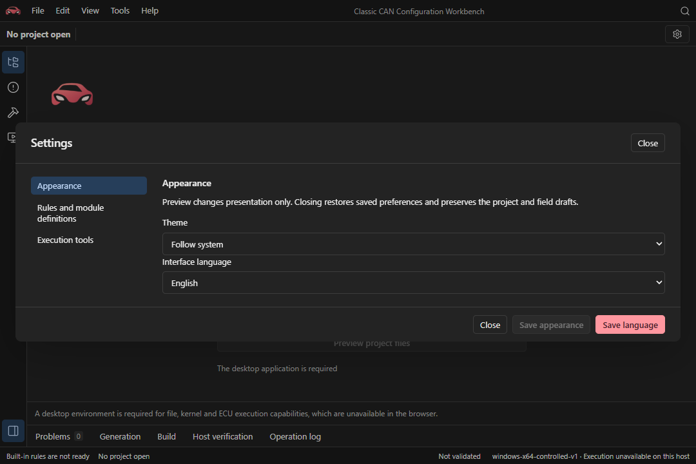

<div align="center">
  
  <h1>Autsaro</h1>
  <p>A configuration and code-generation workbench for AUTOSAR Classic</p>
  <p><sub>Prototype stage — not production-ready.</sub></p>
</div>

[简体中文](README.zh-CN.md) · **English**

[Features](#features) · [Supported capabilities](#supported-capabilities) · [Workflow](#workflow) · [Development](#local-development) · [Verification](#quality-checks) · [Documentation](#documentation) · [License](#license)

Autsaro creates ECU projects from built-in templates or imports multiple ARXML files. In a single workspace, you can edit configuration, inspect references, preview changes before saving, and generate a standalone C99 source project. The current AUTOSAR Classic release is R24-11.

Everyday configuration and source generation work offline without official XSD/MOD archives or a compiler. Native preflight, builds, and host-behavior verification require the toolchain for the selected target.

## Features

<h3> Configuration editing and reference inspection</h3>

The project tree, frame and signal tables, and property inspector share one workspace. Select an object to inspect parameters and references, and edit CAN IDs, signal layouts, and transmission periods.

<a href="docs/images/workbench-configuration.png"></a>

<table>
  <tr>
    <td width="50%" valign="top">
      <h3> Multi-file projects</h3>
      <p>Organize application, BSW, ECUC, and system descriptions in one project and inspect each file's source role.</p>
      <a href="docs/images/workbench-files.png"></a>
    </td>
    <td width="50%" valign="top">
      <h3> Validation and issue navigation</h3>
      <p>Structure, definition, and generation constraints are reported separately. Navigate from an issue to the relevant configuration object.</p>
      <a href="docs/images/workbench-validation.png"></a>
    </td>
  </tr>
</table>

The screenshots show the Chinese interface.

## Supported capabilities

| Area | Support |
| --- | --- |
| Projects and ARXML | Multi-file import, cross-file references, built-in templates, project-member management, and safe saving |
| Configuration editing | Object tree, field and reference inspection, batch changes, and instance-structure editing |
| CAN signals | 11-bit Classical CAN, DLC 1–8; up to 32 frames and 64 signals per ECU; 1–32-bit unsigned LSB0 little-endian signals |
| Host diagnostics | Bounded DoCAN, sessions, and DID services; selected targets support configurable writes, routines, DTCs, and host-file persistence |
| Source delivery | BSW, OS, RTE/application interfaces, configuration, target dependencies, and offline build tools |

Diagnostic services and capacities differ by generated target. See the [runtime support scope](runtime/README.md). Unsupported configuration is retained as read-only or limits the corresponding operations. Saving and generation have separate checks.

Current execution targets are controlled Windows/Linux host environments. Real MCU operation, hard real-time guarantees, functional safety, and official conformance certification are not provided. Native macOS builds and IPC have not been verified; a native virtual ECU is not provided on macOS.

## Workflow

1. Create a project from a built-in template, open an existing project, or import all ARXML files for the same ECU together.
2. Select objects in the project tree and inspect parameters and references. Review the complete impact of a batch change before applying it.
3. Review and confirm file differences before saving. Previewing does not write to disk. Reimport source files if they have been modified externally.
4. Choose a directory outside the project for source delivery. Configure the target toolchain when you need a build or host verification. Keep build and source directories separate.

Unmodified source files retain their original bytes. Regeneration checks file integrity, retains the previous project as a backup, and does not overwrite user changes. Application and source changes invalidate existing preflight, generation confirmation, and downstream results.

## Interface language

Under **Settings → Appearance**, choose **Follow system**, **简体中文**, or **English**. The selection is previewed immediately and restored on the next launch after saving. Closing settings without saving restores the previous selection. Follow-system mode uses Simplified Chinese in a Chinese-language environment and English otherwise.

Localization covers the interface, operation feedback, and the application's own errors, validation explanations, and remedies. AUTOSAR identifiers, user object names, paths, ARXML, generated source, and raw external-tool logs remain unchanged. Switching language does not change the project, field drafts, or validation/generation results. Operating-system file-dialog controls use the system language.

The complete [Chinese README](README.zh-CN.md) remains available. Linked technical documents retain their original language.

<a href="docs/images/workbench-language-en.png"></a>

## Local development

With Node and npm installed, install frontend dependencies and start the development server from the repository root. Version requirements are in the [contributor guide](CONTRIBUTING.md).

~~~sh
npm ci --prefix ui
npm run dev --prefix ui
~~~

The browser supports interface and frontend-logic development; complete file operations and IPC require the desktop application. For Rust-core and desktop development, prepare the [platform dependencies and local configuration](docs/development/environment.md), then run `npm run tauri --prefix ui -- dev`.

`.node-version` and `.python-version` provide default version selections. Supported ranges are declared in [ui/package.json](ui/package.json) and [pyproject.toml](pyproject.toml); rustup reads [rust-toolchain.toml](rust-toolchain.toml). Cargo, npm, and uv lockfiles pin dependencies. Normal development and strict native acceptance have separately documented version requirements. Official XSD/MOD archives and samples are needed only for the corresponding resource tests, not for the UI, built-in configuration tests, or everyday use.

## Quality checks

~~~sh
npm run test --prefix ui
npm run build --prefix ui
uv run --locked python -B -m unittest discover -s tests/python
cargo test --locked --manifest-path core/Cargo.toml
~~~

These commands run the underlying tools directly and preserve their diagnostics and exit statuses on failure. Run `uv sync --locked` before using the Python tooling. Incremental formatting checks use `autosar_tooling quality --base <baseline-commit>`; without an explicit baseline, local checks inspect pending changes relative to HEAD.

Basic tests, official comparisons, native execution, and GUI/package acceptance are separate layers; see the [testing guide](docs/development/testing.md). Complete resource and native checks use `uv run --locked python -m autosar_tooling verify --scope all --base <baseline-commit>`. Missing or unexecuted layers are not reported as passed.

## Build and distribution

On a native host with the platform dependencies installed, run:

```sh
npm run tauri --prefix ui -- build
```

Artifacts are written under `src-tauri/target/release/bundle/`. Windows is configured for MSI, Linux for deb/AppImage, and macOS for app/dmg; native macOS verification is not complete. Signing, notarization, and public release have not been verified.

The installed application does not require Rust, Node, npm, or uv. Windows requires WebView2; Linux requires WebKitGTK 4.1, Ayatana AppIndicator, and libxml2. Packages do not include official specification archives or compilers. ECU builds and host verification require the corresponding toolchain separately.

## Project layout

| Path | Responsibility |
| --- | --- |
| `core/` | Rust configuration model, ARXML parsing, code generation, and host verification |
| `src-tauri/` | Tauri desktop backend |
| `ui/` | React/TypeScript configuration interface |
| `runtime/` | C99 host runtime delivered with generated projects |
| `scripts/` | Official-resource collection |
| `tools/python/src/` | Development checks and Python tools distributed with delivery packages |
| `tests/` | Python tests and isolated desktop scenarios |
| `docs/` | Specification-resource entrypoints and technical documentation |

## Documentation

| Document | Purpose |
| --- | --- |
| [Contributor guide](CONTRIBUTING.md) | Development and contribution workflow |
| [Environment setup](docs/development/environment.md) | Task-specific dependencies and environment troubleshooting |
| [Testing guide](docs/development/testing.md) | Local checks, test layers, and CI |
| [Host runtime](runtime/README.md) | Runtime interfaces, communication, and diagnostic scope |
| [Controlled OS target](runtime/os/README.md) | Kernel, patches, toolchains, and platform scope |
| [Standalone handoff project](runtime/reference-README.md) | Offline reference package and independent verification |
| [Specification resources](docs/official/README.md) | Local archive locations and distribution restrictions |
| [Interface design](DESIGN.md) | Visual and component standards |

## License

Original source and documentation are licensed under [Apache-2.0](LICENSE); copyright notices are in [NOTICE](NOTICE). Third-party components retain their respective licenses. Rights holders determine the licenses of user configuration and application code. Generated projects include the project license and notices. See the [licensing guide](docs/maintainers/licensing.md) for distribution requirements and scope.
