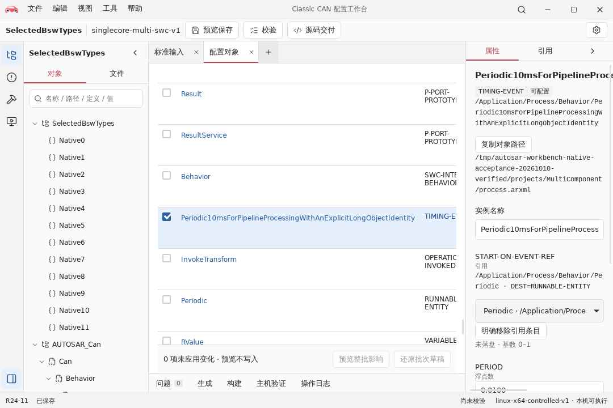

<div align="center">
  
  <h1>Autsaro</h1>
  <p>面向 AUTOSAR Classic 的配置与代码生成工作台</p>
  <p><sub>当前处于原型阶段，不具备生产可用性。</sub></p>
</div>

**简体中文** · [English](README.md)

[功能一览](#功能一览) · [能力范围](#当前支持) · [使用流程](#使用顺序) · [本地开发](#本地开发环境) · [验证](#代码质量检查) · [文档](#文档导航) · [许可](#许可证)

Autsaro 支持从内置模板创建 ECU 工程，或导入多份 ARXML；在同一工作区编辑配置、检查引用、预览保存差异，并生成独立 C99 源码工程。当前采用 AUTOSAR Classic R24-11。

日常配置与源码生成可离线使用，无需官方 XSD/MOD 或编译器。执行本机预检、构建和主机行为验证前，需要准备对应目标的工具链。

## 功能一览

<h3> 配置编辑与引用检查</h3>

工程树、帧与信号表、属性检查器共用同一工作区。选择对象后，可检查参数与引用关系，编辑 CAN ID、信号布局和发送周期。

<a href="docs/images/workbench-configuration.png"></a>

多组件应用沿同一工程树和检查器编辑事件周期、组件实例引用及连接批次。创建各组件的应用源码前先预览初始化；后续生成读取用户源码形成快照，保留原工程中的源文件字节。

<a href="docs/images/workbench-multi-editing-zh.png"></a>

<table>
  <tr>
    <td width="50%" valign="top">
      <h3> 多文件工程</h3>
      <p>在同一工程中组织应用、BSW、ECUC 与系统描述，查看各文件的来源角色。</p>
      <a href="docs/images/workbench-files.png"></a>
    </td>
    <td width="50%" valign="top">
      <h3> 校验与问题定位</h3>
      <p>结构、定义与生成约束分别报告；从问题详情定位到对应配置对象。</p>
      <a href="docs/images/workbench-validation.png"></a>
    </td>
  </tr>
</table>

## 当前支持

| 范围 | 支持内容 |
| --- | --- |
| 工程与 ARXML | 多文件导入、跨文件引用、内置模板、项目成员管理与安全保存 |
| 配置编辑 | 对象树、字段与引用检查、批量修改、实例结构编辑 |
| CAN 信号 | 11 位 Classical CAN，DLC 1 至 8；每 ECU 最多 32 帧、64 信号；1 至 32 位无符号 LSB0 小端信号 |
| 主机诊断 | 有限 DoCAN、会话与 DID 服务；部分目标可配置写入、例程、DTC 与主机文件持久化 |
| 源码交付 | BSW、OS、RTE／应用接口、配置、目标依赖与离线构建工具 |

各生成目标支持的诊断服务和容量不同，详见[运行时支持范围](runtime/README.md)。未支持的配置会保留为只读，或限制相关操作。保存和生成各有独立的检查条件。

当前运行目标为受控 Windows／Linux 主机环境，不提供真实 MCU、硬实时、功能安全或官方符合性认证。macOS 原生构建与 IPC 尚未验证，不提供本机虚拟 ECU。

## 使用顺序

1. 从内置模板新建工程，打开已有工程，或一次导入同一 ECU 的全部 ARXML。
2. 在工程树中选择对象，检查参数与引用；批量修改先查看整批影响，再应用。
3. 保存前查看文件差异并确认。预览不写磁盘；来源文件被外部修改后须重新导入。
4. 选择工程之外的目录交付源码。需要构建或主机验证时，再配置对应目标的工具链；构建目录与源码目录分开。

未修改的来源文件保留原字节。重复生成会核对文件完整性，旧工程保留为备份，不覆盖用户修改；应用与来源变化会使已有预检、生成确认和下游结果失效。

## 界面语言

在“设置 → 外观”中选择“跟随系统”“简体中文”或“English”。选择后即时预览，保存后在下次启动恢复；未保存直接关闭会恢复原选择。跟随系统时，中文环境使用简体中文，其他环境使用英文。

语言覆盖界面、操作反馈及软件自身的错误、校验说明和修复建议。AUTOSAR 标识符、用户对象名、路径、ARXML、生成源码和外部工具原始日志保持原文；切换语言不改变工程、字段草稿或校验／生成结果。操作系统提供的文件对话框控件使用系统语言。

本页提供完整[英文版本](README.md)。链接的技术文档保留各自原有语言。

## 本地开发环境

准备 Node 和 npm 后，在仓库根目录安装前端依赖并启动开发服务器。版本范围见 [贡献指南](CONTRIBUTING.zh-CN.md)。

~~~sh
npm ci --prefix ui
npm run dev --prefix ui
~~~

浏览器可开发界面和前端逻辑；完整文件操作及 IPC 使用桌面应用。Rust 核心和桌面开发需另准备 [平台依赖与本地配置](docs/development/environment.md)，随后运行 `npm run tauri --prefix ui -- dev`。

`.node-version` 和 `.python-version` 提供默认版本选择；支持范围由 [ui/package.json](ui/package.json) 和 [pyproject.toml](pyproject.toml) 声明，Rust 由 [rust-toolchain.toml](rust-toolchain.toml) 管理。依赖由 Cargo/npm/uv 锁文件固定。正常开发与严格原生验收的版本要求分别说明。官方 XSD/MOD/样例仅用于对应资源测试，不是 UI、内置配置测试或普通应用使用的前置条件。

## 代码质量检查

~~~sh
npm run test --prefix ui
npm run build --prefix ui
uv run --locked python -B -m unittest discover -s tests/python
cargo test --locked --manifest-path core/Cargo.toml
~~~

这些命令直接运行对应工具，失败会保留其诊断与退出状态。Python 工具先执行 `uv sync --locked`。增量格式检查使用 `autosar_tooling quality --base <基准提交>`，本地未指定基准时检查相对 HEAD 的待提交改动。

基础测试、官方对照、原生运行及 GUI/安装包验收分别执行，见 [测试指南](docs/development/testing.md)。完整资源与原生检查使用 `uv run --locked python -m autosar_tooling verify --scope all --base <基准提交>`；缺失或未运行的层不显示为通过。

## 构建与分发

在已准备平台依赖的原生宿主上运行：

```sh
npm run tauri --prefix ui -- build
```

产物位于 `src-tauri/target/release/bundle/`。Windows 配置 MSI，Linux 配置 deb／AppImage；macOS 配置 app／dmg，但尚未完成原生验证。签名、公证与公开发行尚未验证。

安装后的应用不需要 Rust、Node、npm 或 uv。Windows 需要 WebView2，Linux 需要 WebKitGTK 4.1、Ayatana AppIndicator 和 libxml2。安装包不包含官方规范档案或编译器；ECU 构建与主机验证另需对应工具链。

## 项目结构

| 路径 | 职责 |
| --- | --- |
| `core/` | Rust 配置模型、ARXML 解析、代码生成与主机验证 |
| `src-tauri/` | Tauri 桌面后端 |
| `ui/` | React／TypeScript 配置界面 |
| `runtime/` | 随生成工程交付的 C99 主机运行时 |
| `scripts/` | 官方资料收集 |
| `tools/python/src/` | 开发检查与随交付包分发的 Python 工具 |
| `tests/` | Python 测试与隔离桌面场景 |
| `docs/` | 规范资料入口与技术文档 |

## 文档导航

| 文档 | 用途 |
| --- | --- |
| [贡献指南](CONTRIBUTING.zh-CN.md) | 开发与提交流程 |
| [环境配置](docs/development/environment.md) | 按任务安装依赖及排查环境 |
| [测试指南](docs/development/testing.md) | 本地检查、测试分层及 CI |
| [主机运行时](runtime/README.md) | 运行接口、通信与诊断范围 |
| [受控 OS 目标](runtime/os/README.md) | 内核、补丁、工具链与平台范围 |
| [独立交接工程](runtime/reference-README.md) | 离线参考包与独立复验 |
| [规范资料入口](docs/official/README.md) | 本地规范档案的位置与分发限制 |
| [界面设计](DESIGN.zh-CN.md) | 视觉与组件规范 |

## 许可证

项目原创代码与文档采用 [Apache-2.0](LICENSE)，版权声明见 [NOTICE](NOTICE)。第三方组件保留各自许可证；用户配置与应用代码的许可由其权利人决定。生成工程附带项目许可证和声明，具体范围及分发要求见 [许可说明](docs/maintainers/licensing.md)。
