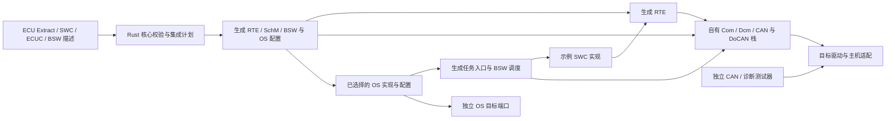

# Epic 4 架构契约

维护者已确认 Q1：Epic 4 主路线固定为 FreeRTOS 内核＋自有 AUTOSAR OS 语义实现＋有限单核策略扩展；Q2 的显式 S/R＋同步 C/S 应用 DID 已确认。原生 Windows 交付边界保持，Trampoline/ATK2 等只作参考和备选，不继续并列选型。路线采用不等于生产依赖已集成、完整 SC1 已通过或实施就绪；本轮不开始功能开发。输入、类型、服务签名、所有权、时间与验收依赖已固定在 [集成契约](INTEGRATION-CONTRACT.md)。证据见 [规范契约](R24-11-CONTRACT.md)、[FreeRTOS 调查](FREERTOS-FEASIBILITY.md)和 [比较记录](TRAMPOLINE-COMPARISON.md)。

## Design Paradigm

采用端口与适配器架构及“解析→契约校验→集成计划→生成”的流水线。Rust 核心拥有配置语义与计划；应用和自有 BSW 依赖生成的标准接口；OS 实现及主机适配位于目标边界。

## Inherited Invariants

父文档 [architecture.md](../../architecture.md) 没有 AD 编号或父级 spine；继承以下原有约束，不为它们补造父级编号：R24-11 ARXML 为配置权威；Rust 核心负责校验与确定性生成；保留无关有效输入，拒绝不安全保存；自有 BSW 与外部 OS/驱动的来源分开；主机/MCU 证据独立；六道证据门；测试不占用交互桌面。Epic 3 历史主机输入不自动成为 Epic 4 的标准输入。

## Invariants & Rules

### AD-1 — 单一配置与集成计划权威 [ADOPTED — inherited policy]

- **Binds:** FR-1–FR-4；解析、UI、各模块生成器、交接入口。
- **Prevents:** 各生成器各自猜测 ECU、信号、接口和目标所有者。
- **Rule:** ARXML 是唯一持久化配置；核心派生并校验一份目标明确的集成计划。对象以完整 AUTOSAR 路径及实例引用标识；内部数值 ID 仅由计划分配。沿用 Epic 3 的逻辑相对文件身份及原始文件字节 SHA-256；计划中的对象身份不能用规范化 XML 摘要替代，格式扩展显式版本化。每个外部符号及产物恰有一个生产者，所有消费者、类型和目标必须闭合。UI 与交接入口使用同一计划，不能补充隐含映射；未通过不写输出。本 AD 采纳的是父架构的权威/闭包政策，不声称新计划已实现。

### AD-2 — 输入角色与来源不可互换 [ADOPTED — architecture decision]

- **Binds:** FR-1–FR-4；参考输入、BSW 交付、外部依赖。
- **Prevents:** 用 ECUC 或官方 showcase 的任意 XML 冒充完整 ECU Extract，或把官方描述当作自有 BSW 描述。
- **Rule:** 首个剖面接受已经展开的单 ECU `ECU_EXTRACT`，连同所引用 SWC/数据类型/通信映射、选定自有 BSW 实现的描述与 ECUC 定义、该 ECU 的配置值和应用实现。产品原创参考输入与代码；官方 Schema、MOD 和 showcase 只作合法取得的外部校验参考，不默认随包分发。实际工程允许用户提供符合相同契约的输入；首版不实现通用 System→Extract 提取器。所有必需输入、版次、来源及缺失拒绝见契约矩阵。

### AD-3 — 先形成组件契约，再生成 ECU 集成 [ADOPTED — interface scope]

- **Binds:** FR-5/FR-8；SWC、RTE、Com、OS 配置生成。
- **Prevents:** 由信号表硬编码 RTE，或应用和 ECU 生成器各自定义不兼容 API。
- **Rule:** 已确认的接口范围是显式标量 S/R＋一个同步 C/S DID。固定首版剖面：首个应用为单实例、不可重入的 `ApplicationSwComponentType`，Tx/Rx 各一个未排队的 `uint32` 数据元素，带完整应用/实现数据类型映射；具体类型、初值、错误及字节预期按集成契约执行，属于本轮架构决定。契约阶段从端口、访问、Runnable 和 Event 生成组件头文件；集成阶段从 ECU/通信映射及 `RteEventToTaskMapping` 生成实现与调度绑定。`TimingEvent` 的周期、位置及 OsAlarm/ExpiryPoint 引用须一致；禁止由模板自行选择。初始化、无数据、无效和超时的 RTE/Com 语义写入配置与拒绝向量；不得沿用私有 `valid` 参数冒充标准 API。影响该剖面的队列、隐式访问、多实例、mode、transformer 或未选变体被拒绝；无关有效内容按父约束保留。

### AD-4 — 应用 DID 通过已声明的服务契约访问 [ADOPTED — synchronous C/S scope]

- **Binds:** FR-5/FR-9；Dcm、RTE、应用状态。
- **Prevents:** 诊断和 CAN 各持一份应用值，或 Dcm 绕过应用读取 Com 内部信号。
- **Rule:** 采用 `DcmDspDataUsePort=USE_DATA_SYNCH_CLIENT_SERVER`，一个本 ECU 同步 `ReadData` 操作与服务器 Runnable，由生成的 BSW 服务绑定经 RTE 访问应用快照。服务器属于 AD-3 同一个应用组件实例，其提供端口/操作以 `OperationInvokedEvent` 绑定到该 Runnable，不另设拥有应用状态的服务 SWC。Dcm 服务使用端、组件提供端及生成符号必须在计划中一一对应，接口形状按集成契约的固定四字节 UINT8_N 同步 ReadData；正常服务器填数据并返回 E_OK，基础设施错误单独处理。应用为状态唯一所有者；应用编码快照数据为大端四字节；Dcm 负责协议 SID/DID、长度、会话/访问校验与协议拒绝。首版不支持异步/PENDING、跨 ECU C/S 或动态 DID。维护者已确认 Q2 为显式 S/R＋一个同步 C/S 应用 DID；标准函数方案保留为比较记录，不在本剖面实现。接口已固定；实际输入和新目标执行证据属于实施工作包。

### AD-5 — OS 等级与参考配置分开 [ADOPTED — SC1 target]

- **Binds:** FR-6/FR-12/FR-14；OS 选择、生成配置、证据。
- **Prevents:** 把“此 ECU 只用两个任务”解释为已实现 SC1，或把旧 OS 的标准命名入口视为 R24-11 证据。
- **Rule:** OS 目标固定为单核 SC1；参考配置固定 Extended Status。实现能力须审查 OSEK 全部一致性类、计数器/计时、调度表、栈监测和适用错误/Hook/中断等义务；SC1 的最小容量为两个调度表、八个软件计数器，不能缩减为样例实际对象数。R24-11 ARTI 描述/Hook 和其他未由等级表豁免的条款纳入差距矩阵。只有配置集成向量通过时，仍仅称“SC1 目标的有界主机集成”；等级能力证据全部闭合后方可提出 SC1 实现声明。每个声明 SC1 的目标都须证明真实执行栈故障监测和处理；原版 Windows 端口的 FreeRTOS 栈数组不是实际执行栈，不能用其 guard/high-water 代替，也不能把主机义务移到 MCU 后继续宣称主机 SC1。更高等级功能若提供仍遵守对应接口，不能自定义替代标准语义。

### AD-6 — 一个调度与时间所有者 [ADOPTED — architecture decision]

- **Binds:** FR-5/FR-6/FR-8/FR-9；RTE/SchM、OS、主机输入与 BSW 状态。
- **Prevents:** RTOS 任务与 `Os_Advance` 双重推进时间；宿主线程直接修改 BSW；同步 DID 数据撕裂。
- **Rule:** OS 拥有任务状态及计数器推进；主机输入只能入有界队列，经目标适配在 OS 边界注入模拟 ISR/任务事件。目标入口为该 ECU 分配统一逻辑 tick/epoch 和单调事件序号，不由 CAN、诊断各自排序；按集成契约的 uint64 epoch、标准 Counter 模数与溢出拒绝执行。同刻输入、tick、ISR、task 与 timeout 的优先关系是唯一集成计划的一部分；选择未固定或与端口语义不符时拒绝生成，不用宿主线程到达顺序填补。首个目标为 controlled_logical_ms，HostBatchV1 单批有界输入、逐毫秒请求/确认推进；Task_Ecu 串行拥有 BSW/应用，输入先于 deadline、应用先于 Dcm，具体启动、顺序和 mailbox 故障按集成契约执行。时间源由目标档案显式选择，生成配置统一绑定周期与偏移，不混用虚拟/墙钟时间。阻塞 stdin/socket/文件操作留在宿主桥外，不进入被调度任务。每个周期 BSW 实体恰有一个调度调用者，计划完整覆盖原主机的周期工作并固定 Runnable/BSW 的周期、任务位置、偏移及先后关系；无法唯一决定同刻数据可见性时拒绝生成。SchM/ExclusiveArea 明确共享缓冲和应用快照的锁定协议，不能一律用 FreeRTOS mutex 代替 OSEK resource。旧轮询运行时留在原主机目标作回归；Epic 4 不同时链接其 OS/RTE 入口。

### AD-7 — 交付与证据绑定目标及权利 [ADOPTED — inherited policy]

- **Binds:** FR-4/FR-6/FR-14/FR-15；构建、交接、支持声明。
- **Prevents:** 候选源码可下载便自动集成，主机通过便继承 MCU 时序，构建通过便提升支持声明。
- **Rule:** 每个组合固定 OS/端口/配置器/编译器修订、摘要、来源与实际适用许可；产品代码和外部依赖分别列入输入及产物闭包。标准参考原件、工具许可和 AUTOSAR 商用权利不能由某个内核的源码许可推定。主机接口/逻辑行为、实现能力与 MCU 实时性/ISR/内存段分别取证；未跑为 `not_run`，拒绝/失败为失败。沿用 Epic 3 的安全预览、完整性和新目录独立复验规则；原生 UI 仅在隔离桌面验收。

### AD-8 — 复用内核机制，自有汽车 OS 语义与依赖维护 [ADOPTED — owner confirmed]

- **Binds:** FR-6/FR-12/FR-14/FR-15；OS 语义实现、FreeRTOS backend、配置生成与交付。
- **Prevents:** 把内核复用等同于标准语义已通过，建立两个运行调度器，或让上层直接依赖 FreeRTOS。
- **Rule:** 采用固定源码的 FreeRTOS Kernel 加产品维护的有限单核策略扩展为唯一运行调度及上下文切换所有者，自有层维护 AUTOSAR 对象状态、校验和行为契约，经唯一 backend 适配内核。FreeRTOS 维护底层就绪队列并裁定实际 Running/切换与抢占；产品层的完整激活请求 FIFO、事件、资源与逻辑状态必须通过已验证映射驱动内核就绪性/优先级，状态观测须与 backend 一致，不另建选择下一 runnable 的算法。若这条边界无法承载标准顺序则路线门失败，不静默把 FreeRTOS 降成纯上下文切换器。RTE/BSW/应用只调用声明的标准接口。AUTOSAR 对象静态配置，所用 FreeRTOS 对象优先静态创建；端口内部和宿主资源分配单独核查，不声称整个 Windows 进程无动态分配。Rust 核心从同一 ECUC/计划生成 OS 配置和 FreeRTOSConfig；端口、内核源码及补丁以版本/摘要/来源与许可固定，不在构建时拉取浮动版本。公共 API 能保留时优先保留；本轮已复现原版同级抢占恢复与 ceiling 恢复差异，不能按薄 API 封装估算。内核策略扩展须封装于唯一 backend，保持全部请求的规范顺序、当前实例位置及原子移交；每项变更有差距、独立向量与可审阅补丁。研究补丁不是生产实现或完整 FIFO 证明；若 A2 请求先于 B1，不能在 A1 结束时无条件把 A2 插到 B1 后。若正确实现需要替换主要调度器、失去有限补丁维护边界，或证明无法满足所声明 Windows 目标的真实栈契约，触发 [可行性报告的停止条件](FREERTOS-FEASIBILITY.md)并重新评估路线；普通待验证项不重新打开选型。路线已采用，不把它当作完整实现已通过。门禁至少覆盖重复激活/终止重启/ChainTask、同优先级与非抢占、事件竞态、资源上限及 ISR 上下文、计数器/调度表同刻顺序、错误/Hook/栈/ARTI。宿主时间和输入仍由 AD-6 的统一目标契约绑定，不直接以 FreeRTOS tick 替换未经校验的汽车时间语义。

### AD-9 — 架构、进入条件和实现出口分层 [ADOPTED — architecture decision]

- **Binds:** Epic 4 规划、规格、stories、就绪与验收。
- **Prevents:** 以尚未实现作为架构不能定稿/基础实现不能开始的循环条件，或以架构定稿冒充功能完成。
- **Rule:** 集成契约固定 W0–W5 的进入/产物/依赖。W0 输入基线及 W1 backend 可以从最终架构拆成有验收的 stories；W2 依赖 W0，可与 W1 并行；W3 必须等 W1 核心语义、受控 tick、真实栈和 W2 生成闭包通过。全部 SC1、独立交接与声明证据属于 W5/Epic 退出，不前置到架构定稿或 W1 开始。本轮只完成规划，不创建 ready-for-dev stories或开发功能。

## Capability → Architecture Map

| 范围 | 实现责任 | 契约 |
| --- | --- | --- |
| FR-1–FR-4 输入/计划/交付 | Rust 核心＋交接入口 | AD-1/2/7 |
| FR-5 SWC/RTE、FR-8 应用信号 | 模型驱动生成器＋应用＋自有 BSW | AD-3/6 |
| FR-9 应用 DID | Dcm＋生成 RTE 服务绑定＋应用 | AD-4/6 |
| FR-6、FR-12 运行基础 | 选定 OS＋独立目标适配＋生成 SchM | AD-5/6/7/8 |
| FR-14/FR-15 证据/交接 | 独立测试器＋目标档案 | AD-7/9 |

## Decision Status & Technical Closure

- **Q1（已确认）：**以单核 SC1 为目标，固定 FreeRTOS 内核＋自有 AUTOSAR OS 语义实现＋有限策略扩展为主路线。V11.3.1/commit 054e14f3397023aa83813a65aa065fc4597d481b 为已核查基线，生产依赖尚未引入。维护有限扩展的责任已接受，原生 Windows 边界保持；Trampoline/ATK2/商业 OS 等仅作参考与备选。仅在 AD-8 停止条件实际发生时重新选型。
- **Q2（已确认）：**显式标量 S/R＋一个同步 C/S 应用 DID。服务签名、类型、映射及参考样例已由集成契约固定。
- **原 Q3（证据口径，不再作为选型待决）：**当前局部主机证据只能支持有界 BSW-on-RTOS 描述；完整 SC1 继续作为 FR-6/Epic 4 退出门，不能因中间成果把 Epic 4 标为 done。任何降低退出门的范围变更仍需维护者明确决定，本次未作该变更。
- **技术闭合：**完整激活 FIFO、原子终止/Chain 与错误回滚、事件/资源/ISR、计时/调度表、真实栈和 R24-11 条款/实际输入证据尚未全部通过，按 W0–W5 在实施中逐项交付；不以架构定稿替代证据。

## Deferred

- Epic 5 拥有完整单网络 NM、DTC/NvM 语义与持久化；Epic 4 仅常开 CAN 和声明物理诊断回归，不移除已有能力，也不继承其规范通过结论。
- Epic 6 拥有板卡、MCU OS 端口、MCAL/RTD 版次转换、工具链与物理对端；本稿不选购板卡。具体 MCU 仍须独立审核。
- 端口内部布局、完整生成计划结构、C 文件划分由后续 spec 按已采用 Q1 决定；跨单元共享的类型、时间/事件顺序、错误与启动契约已固定在集成契约，不能留给各 story 自选。
- 无云服务、部署或线上运维依赖；环境边界为离线 Windows 交付目录与后台测试进程。安装包和供应商工具分发不是本 Epic 隐含承诺。

当前结论：**Epic 4 架构契约已收口；已完成独立审阅并定为 final。`4844e1d` 已确认 W0–W5 共 22 条 stories，当前 sprint 规划就绪检查在此范围 PASS；尚无 ready-for-dev 开发工件，实施保持 backlog。首批进入条件与依赖见 [实施就绪判断](../../implementation-readiness.md)；实现证据按 W0–W5 交付，不阻断架构定稿。本轮不开发功能。**
