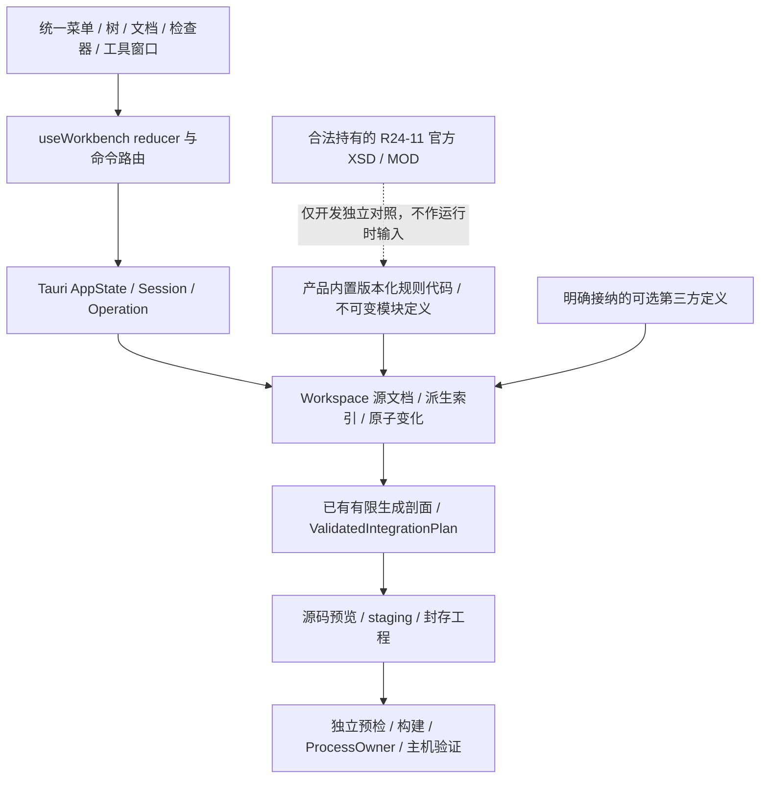

# Architecture Spine — R5 统一 ECU Configurator

## Design Paradigm

源文件支撑的事务式分层工作台。ARXML 原字节是配置权威；Workspace 派生对象／定义投影，Session 串行接受变化，React reducer 管理唯一交互上下文。定义编辑与生成剖面是同一输入的不同消费者，不用配置编辑权限推定生成能力。

本轮为已批准的前瞻性规划更新，不是实现验收：现有软件仍使用外部 XSD/MOD，本任务没有新增原生校验代码。新 R5 默认由软件自带的产品原创规则与模块定义完成校验／编辑；官方档案只作为开发参考 oracle，不是普通使用者的安装、保存或生成前置条件。历史 Epic 1/3/4 的行为与完成证据不改写。

## Inherited Invariants

[根架构](../../architecture.md)的配置原字节权威、唯一 Session／reducer、预览 fingerprint、受管进程、源／执行分离与隔离原生验证保持约束。已批准的新 R5 内置规则方案取代普通用户必须提供官方档案的旧默认，不改变历史格式所需的外部身份／完整性校验。Epic 4 的 OS、输入／集成及 wire identity 不改写；本架构不是 Epic 4 子级，不重编号或复制其 AD。当前行为事实见 core/src/arxml.rs、arxml/persistence.rs、integration/graph.rs、integration/configuration.rs、generator/output.rs，src-tauri/src/workbench.rs 和 ui/src/workbench/useWorkbench.ts；下述内置规则条款是待实现契约。

## Invariants & Rules

### AD-1 — 配置权威与投影 [ADOPTED]

- **Binds:** all
- **Prevents:** React、通用图或项目文件分别保存另一份配置。
- **Rule:** Workspace 保留每个 Source 的 saved/current 原字节、逻辑来源和文件身份；对象图／定义索引／表格是可重建投影，不作为序列化权威。扩大现有 Workspace，不另建持久配置库。现有 CAN 和标准集成视图从同一源集合产生；未知有效内容不得因展示或编辑其他对象被重写。

### AD-2 — 能力分层而非全局资源门

- **Binds:** CFG-1.1, CFG-1.2, CFG-3.1
- **Prevents:** 缺用户 XSD、MOD 或 GCC 就无法校验／编辑内置支持输入；未执行或未覆盖规则被标为通过。
- **Rule:** Session／Workspace 不要求用户官方资源。打开、原文查看、源结构索引与原创模板建立先执行路径、大小、编码、良构／DTD 实体 source-safety 检查，不要求编译工具。默认 BuiltinRuleSet 提供声明覆盖范围内的原生 schema／definition 校验及模块定义，合法受支持的 CAN 和标准 ECU 输入可以离线编辑、保存、重开、校验和生成源码；原生执行另要求宿主、目标和工具链。可选扩展定义只约束实际消费它的字段／模块，未配置扩展不关闭内置能力。Reply capabilities 按动作给出 available/reason 与实际 validation state／coverage，不以一个 disabled 推断全部能力。未知覆盖保持 unsupported，真正未执行才是 not_run；内置规则安装故障明确报错，不能以下载官方包或缓存假成功代替。

### AD-3 — 一套对象身份

- **Binds:** CFG-2.1, CFG-2.3, CFG-NFR-2
- **Prevents:** 显示名／路径改动定位错误、旧草稿被应用到重开后的对象。
- **Rule:** 后台分配不透明字符串 workspaceEpoch、sourceId、objectId、fieldId；sourceId 属于明确源集合，objectId 是实例身份不是 SHORT-NAME/path，fieldId 标识实例的具体值条目。既有对象在同一 Workspace 的改名／字段修改中保留 objectId，新增对象获得新 ID，删除 ID 不复用；重开或切换工程更换 epoch。路径仅用于显示与解析诊断。ChangeSet.inputFingerprint 指当前 capabilities.fingerprint，由 AppState::begin 核对；Reply.inputFingerprint 仅回显此次请求身份，不是下一次可写 token。每次发布以后取返回 capabilities／projection 的当前 fingerprint 继续请求。树／表／引用／问题／草稿用同一组身份，禁止 UI 生成另一套业务 ID。

### AD-4 — 定义描述配置，不替代生成语义

- **Binds:** CFG-2.2, CFG-3.1, CFG-4.1
- **Prevents:** 从 VALUE 猜类型、把第三方定义当内置覆盖、从定义存在推断支持模块生成。
- **Rule:** 默认 DefinitionCatalog 来自产品原创、不可变且经 RuleSetIdentity 核定的模块 metadata，完整覆盖全部产品已支持的 BSW／配置剖面，不只覆盖演示表单。初始可编辑种类为非变体条件的 integer/float/boolean/enumeration/string/function-name/reference；描述符包含基数、范围、枚举、单位、默认值来源、目标 kind、可写性和原因。可选第三方 catalog 仅经明确导入后按 catalogId／release／version／sha256 接纳，在独立命名空间内解析其消费者，不能覆盖内置定义；定义路径／身份冲突拒绝，不自动择一或默认填值。未支持的表达式、variation point、条件基数、instance-reference 语义及未确定版次只读／诊断，不用默认值补齐。普通引用遵守定义目标与实际 DEST。生成仍调用现有有限剖面；未实现模块只有配置能力，相关未解释消费对象阻断该目标生成，非相关保留内容不被静默删除。原生结构与定义校验分别报告，不冒称完整官方 XSD／SWS 通过，也不替代目标规则；官方 XSD/MOD 只在开发对照中使用。

### AD-5 — 原子 ChangeSet 是唯一配置变化入口

- **Binds:** CFG-2.2, CFG-2.3, CFG-2.4, CFG-NFR-1
- **Prevents:** 逐项 IPC 造成部分修改、引用改名失配或全局字符串替换。
- **Rule:** ChangeSet={workspaceEpoch,inputFingerprint,definitionFingerprint,changes[]}，具体 wire 联合与 prepare/apply 绑定见下节。后台先解析全部目标及冲突，在 prospective graph 中计算结构／引用影响闭包和已知配置约束，按原文范围生成补丁并重建索引；合法候选一次发布、revision 只推进一次。失败按 changeId／字段返回问题，旧 Workspace 不变。新增和恶化约束拒绝，允许保留完全未变的旧违规见 Validation scopes；未知生成语义不是禁止全部安全修复的理由。改名同时更新全部可核定入站引用；移除未在同批解决的入站引用拒绝。无法确定受影响引用／变体或保持未知内容时拒绝，而非猜测。

### AD-6 — 保存与原文读取 [ADOPTED]

- **Binds:** CFG-2.5, CFG-NFR-1
- **Prevents:** UI 写任意路径、旧预览覆盖外部改动、Schema 状态冒充保存状态。
- **Rule:** 原文获取只接受当前 sourceId＋fingerprint，从 Workspace snapshot 读取，不接受任意绝对路径。源安全保存继续使用 PreparedSave／原文摘要／create_new staging／备份与恢复；manifest 的成员变化与源集合保存进入同一确认事务。确认绑定 before/current bytes、路径集合、RuleSetIdentity／definitionFingerprint 及外部状态；外部修改、规则／定义变化或未恢复备份拒绝旧确认。未修改文件不写；不能恢复时保留可恢复备份及具体状态，不返回 clean。保存所需验证按 Validation scopes 判断：拒绝任何声明覆盖内的实际 native schema error，不将 target-generation 错误当成源保存门，不因为未提供官方 XSD 而跳过必需的内置检查；未执行／未覆盖分别保持 not_run／unsupported。

### AD-7 — 可搬移的工程成员与原创模板

- **Binds:** CFG-1.2, CFG-1.3, CFG-4.2
- **Prevents:** 个人绝对路径、模板覆盖或项目文件成为可伪造的生成计划。
- **Rule:** 新工程使用 workbench-project.json v1，保存 formatVersion、declaredRelease、profileHint、有序 inputs[{path,roleHint}]、显式 applicationInputs[{path,producerSlot}] 及按 catalogId 排序的 acceptedExtensionDefinitions[{catalogId,release,version,sha256}]。这些只记录源成员与该工程已明确接纳的扩展身份，不存配置参数、定义副本、通过状态或源机器路径；builtin-only 工程的扩展集合为空。路径为工程根下唯一相对路径，拒绝绝对路径、..、链接逃逸、角色／producerSlot 冲突；applicationInputs 仅允许已有应用槽。hint 与复制的校验 token 不可信：按实际源集合、RuleSetIdentity 和已核验的扩展原字节重建 catalog、识别并校验剖面，native schema 只作用 ARXML。重开／搬移按记录的精确身份从本机不可变扩展缓存解析，缺失或损坏不默选其他版本、机器全局默认或内置同名定义，仅限制实际消费者并保留源文件供补充明确接纳。直接多文件 ARXML 打开仍支持原路径，未建立 manifest 不强行复制；“保存为工程”先预览复制到新空目录并保存本会话接纳集合，成员／接纳集合与源保存用同一 PreparedSave 事务。模板 ID 为 can-empty-v1、can-signals-v1、standard-ecu-v1，均为产品原创输入并由内置规则／定义校验；默认无扩展、不附官方包／密钥／构建结果。实例化核对目标全部不存在后由 owned staging 建立完整集合，失败不留下误认成功的工程。原交接格式不按 manifest hint 旁路验证，用户应用仅明确初始化一次。

### AD-8 — 一个工作台状态与公共命令路由 [ADOPTED]

- **Binds:** CFG-2.1, CFG-3.2, CFG-NFR-2, CFG-NFR-3
- **Prevents:** 多棵竞争树、标签卸载丢草稿、菜单绕过保护、晚结果覆盖新上下文。
- **Rule:** 复用 useWorkbench reducer、call epoch／fingerprint 与 AppState Operation；分解内部 UI 模块而不新增 store。草稿按 epoch/objectId/docKind 或明确批次拥有，表面不拥有配置副本；菜单、工具条、树和快捷键共用动作及能力原因。对象／编辑上下文替换用“应用并继续／放弃草稿／留在原处”；工程替换、重开、两类交接导入及退出用“返回并保存／明确放弃／取消切换”，必须完成全部草稿应用、保存预览与确认才能执行 pending replacement，应用或保存失败不继续。非破坏面板／主题切换保留草稿。问题定位按真实身份，未知目标保留详情；校验结果不因导航消失。长任务使用现有归属和串行 mutating gate，取消先失效再等待 ProcessOwner 实际关闭，失败保持恢复入口。

### AD-9 — 独立验证、生成与拥有权 [ADOPTED]

- **Binds:** CFG-4.1, CFG-4.2, CFG-NFR-4
- **Prevents:** 通用编辑器绕开有限目标 grammar、生成自动编译或覆盖用户算法。
- **Rule:** 实际输入识别及验证选择剖面，ambiguous/mixed 不回退为 CAN；保留 legacy CAN、epic4-win64-sr-cs-v1 和 Windows/Linux target contracts。ValidatedIntegrationPlan 拥有已验证生成关系，不是浏览／安全修复的唯一图。新 R5 生成消费已保存输入／应用快照、RuleSetIdentity、definitionFingerprint／必需扩展定义身份、目标、目录及交付种类，只安装预览字节；官方档案和编译器都不是内置支持范围内的源码准备条件。拥有权与 sealing 按下节 workbench-ownership.json v1 契约由预览、staging、生成、构建、交接与离线验证共同消费；旧 wire format 保持原分派及资源完整性语义，不自动升级或将历史 XSD/MOD hash 替换成内置规则 hash。用户 live 应用不进入生成器可写集，封存副本不可变。未知拥有权／版本、工具拥有文件改动和未核定升级拒绝，合法移除只来自可核定旧 ledger。预检、构建、主机行为仍独立。R6 沿相同应用槽与拥有权接缝扩展，不引入第二套保存或 integrity 规则。

### AD-10 — 内置规则、扩展定义与设置生命周期 [ADOPTED]

- **Binds:** CFG-3.1, CFG-3.2
- **Prevents:** 官方包再分发／转存规避许可、可变设置替换核心规则、缓存身份漂移、类别草稿串写。
- **Rule:** BuiltinRuleSet 是随软件交付的产品原创验证代码＋不可变产品模块 metadata，绝非官方 XSD/MOD 的加密、原样或自动转换副本。RuleSetIdentity={release,rulesVersion,sha256}，release 本轮为 R24-11，rulesVersion 是独立于规范版次的产品固定规则版号；sha256 对确定性打包 inventory 求摘要，inventory 包含 release／rulesVersion、编译规则实现来源、显式覆盖条目及全部内置 metadata 摘要，不指向官方档案。规则实现／覆盖／内置 metadata 改变须发布新 rulesVersion／sha256，不复用旧身份。构建及启动将 inventory／实际规则／metadata 与编入产品的可信 identity 核对，不信任可写 metadata 自报摘要；缺失或损坏为安装／工具错误。用户设置或 XSD/MOD 环境变量不能替换内置权威。definitionFingerprint 由后台绑定内置定义与明确接纳的可选扩展 catalog；验证、索引、编辑、保存及生成缓存按完整规则／定义／输入身份隔离，不按资源路径缓存。规则／扩展变化使相关草稿应用身份、确认、预览和下游结果失效，保留草稿供核对；缺失／无效扩展仅影响其消费者，拒绝导入不得替换旧 catalog。工具／目标变化仍保守失效。外观／规则与模块定义／执行工具分别原子保存，内置版本／覆盖只读，扩展导入／移除必须显式；官方 XSD/MOD 字段仅限开发或历史兼容，不是普通 setup。编译工具环境覆盖优先且只读说明，失败不替换旧 Session 配置。主题 preference 为 light/dark/system；系统主题事件只改变有效呈现和图形灯位，不重建 reducer 数据。设置沿现有 app_config_dir、AUTOSAR_CONFIG_DIR 隔离方式，无网络账号或收费服务；不信任 schemaLocation 自动联网，不虚构官方公开再分发许可。

### AD-11 — 原生迁移、部署与证据 [ADOPTED]

- **Binds:** CFG-NFR-3, CFG-NFR-4, CFG-NFR-5
- **Prevents:** 只验静态演示、操作用户桌面、包依赖 checkout 或跨目标升级声明。
- **Rule:** 新壳层内嵌在现有 Tauri 包，不采用生产模拟 invoke、原型计时器或新服务进程。正式组件遵守根 DESIGN 与前瞻性 EXPERIENCE；通用编辑新增表面遵守其扩展接入契约，冻结原型中的官方资源 setup 不作为新要求。Windows/Linux 从私有隔离原生会话验证实际 IPC、发行包无 checkout 配置链和独立源码交接，复用 autosar_tooling desktop；macOS 保留实际受支持边界，无隔离宿主标为未验证。安装图形迁入 ui/public 和 src-tauri/icons 时同批移除旧身份引用，PNG RGBA 及明暗灯位同步；桌面 ICO/ICNS 用固定通用灯色，不假称 OS 自动适配。解析/校验/扫描不在 GUI 线程，继承 50 MiB 单输入、路径与 XML 防护，不为了新界面放宽旧检查。开发验收以合法持有且固定的 R24-11 官方 XSD/MOD 为独立 oracle，对照正例及结构／顺序／基数／类型／值／默认值／引用／跨模块和已知不支持的定向反例；不删合法旧测试、压制错误或将必需验证降为 not_run。用户安装烟测不含官方档案路径／环境文件、checkout、Node/Rust/uv 或编译器，实际覆盖编辑／保存／重开／校验／生成与预期拒绝；构建和行为另验。日志保留实际失败及 owned 输出，支持受管取消，不新增遥测、云后端或持久审计产品；本次仅记录要求，不声称已完成这些验收。

## Consistency Conventions

| Interface | Contract |
| --- | --- |
| ProjectProjection | epoch、inputFingerprint=当前 capabilities.fingerprint、ruleSetIdentity:RuleSetIdentity、后台给出的 definitionFingerprint、release/profile、sources/objects/diagnostics/validation/capabilities；object 的 parentId/sourceId/path/kind/definitionId/writable/reason 不构成第二权威；当前 capabilities／input fingerprint 纳入完整规则身份及定义 token；definitionFingerprint 绑定全部内置 metadata＋已接纳扩展 catalog 身份，builtin-only 也由后台发不透明 token，前台仅回显 |
| RuleSetIdentity / coverage | {release,rulesVersion,sha256} 全部按字符串原样传递；产品 inventory 按 ruleId 固定条目，声明 scope、适用对象／模块定义／剖面、supported 或 unsupported 与原因，并绑定实现来源／metadata 摘要；运行结果带该身份和实际覆盖，未列或未解释的相关语义不得推定 supported，前台不重算摘要或生成业务 ID |
| ExtensionDefinitionIdentity | {catalogId,release,version,sha256}；sha256 是已接纳 catalog.json 原字节摘要，inventory 中每个定义路径／文件摘要再绑定完整 catalog 内容，catalogId／version 不足以替代摘要；工程定义 token 由内置 metadata 与按 catalogId 稳定排序的全部工程接纳身份重建，不信任交接复制的 token，消费者及必需扩展子集由后台解析 |
| FieldDescriptor | fieldId、definitionId、kind、cardinality、unit/range/enum/default origin、current explicit value、reference target kind、writable/reason；区分 absent/default/explicit；wire 值为 {kind,lexeme}，整数／浮点不经 JS number 往返，后台按定义解析并拒绝非有限数／非法函数名，未改原 lexeme 保留 |
| ReferenceEdge | source objectId/fieldId、rawPath/DEST、resolved targetId 或 unresolved reason；targetId 只属于当前 epoch，不替代落盘路径／DEST；同一索引用于候选、入站影响及问题定位 |
| ChangeSet / outcome | 下节内部 op-tag 联合；prepare 返回完整影响及 changeRevision，apply 精确确认同一批次；成功返回当前投影、selectionId 和 createdIds 映射，拒绝不返回部分 success |
| Error / validation | 保留现有 Reply<T>{value,capabilities,inputFingerprint} 与原始错误码；新增结构化 diagnostic 统一 severity/code/message/remedy/sourceId/objectId/fieldId，不能仅解析中文字符串作为身份；scope 结果携带 RuleSetIdentity／definitionFingerprint、执行与覆盖状态，区分 passed、failed、unsupported、not_run |
| Apply / save / generate | 分别修改内存／写源配置／写独立源码；内置安装错误、缺必需扩展、未执行、未覆盖和目标不支持是不同原因，不能互换；源码准备无需官方包或编译工具，不能沿用旧规则身份的成功状态 |
| Settings | 现有文件兼容读取新增外观字段的默认值；不重置历史字段或编译工具环境优先级。类别为外观／规则与模块定义／执行工具，内置版号／覆盖只读，官方资源项只属开发／历史兼容且不替代内置规则。新增 manifest 是成员元数据，不是迁移旧配置的强制步骤 |

### Catalog 身份与扩展接纳

ProjectProjection 的 definitionFingerprint 绑定内置 metadata 与该工程明确接纳的全部 catalog，不包含其他工程或机器上未接纳的扩展。生成／交接的 immutable snapshot 以实际消费者闭包确定必需扩展，按相同后台算法重建该 snapshot 的 catalog／definitionFingerprint；validation、缓存、生成预览和重导入消费同一 snapshot 身份。prepare 同时核对当前工程 inputFingerprint／definitionFingerprint 以拒绝过期发布，产物再渲染核对不要求无关 catalog 相同。内置 metadata 身份由 RuleSetIdentity 的 inventory 核定，扩展缺失／拒绝不能改变内置定义权威。

扩展接纳输入固定为 `catalog.json` v1 原字节和其原始模块定义 ARXML 文件；inventory 字段为 `{formatVersion:1,catalogId,release,version,files:[{path,sha256}]}`，path 是 catalog 根下唯一安全相对路径，成员按 path 排序且不得含绝对路径、..、链接逃逸或未列 payload；catalog.json 为保留的 inventory 成员，不得再列入 files。ExtensionDefinitionIdentity.sha256 对 inventory 原字节求 SHA-256，各 files.sha256 对相应定义原字节求 SHA-256；inventory 不包含自己的摘要，避免循环。后台先核对两层摘要／完整成员，再执行 source-safety 与本版 native definition 解析，核对 release、定义路径冲突和支持范围，经用户明确接纳后才加入工程隔离 catalog；仅有复制的身份、校验 token 或附带可执行代码不构成定义接纳。显式移除保留实际 ARXML，受影响字段失去定义能力、相关生成拒绝，无关内置消费者不受资源门影响。

明确导入后的 catalog.json 及全部原字节成员由 7.2 以 owned staging 安装到 `app_config_dir/definition-catalogs/<sha256>/` 的不可变、本机隔离缓存，只有完整摘要／解析核对成功才发布。复用相同身份时仍核对现存成员完整性，损坏拒绝，不把可写缓存自报身份当信任；不执行定义中的代码。缓存是原始扩展资源，不是参数或校验通过状态的第二权威。7.6 起，工程接纳集合通过 manifest 与源集合的同一预览／保存事务持久化；未保存的导入／移除使工程 dirty，失败保留旧源与接纳集合，移除不删除其他工程仍可引用的缓存。重开只恢复该工程持久化的精确身份并重新验证，不自动接纳机器上其他 catalog。未建立 manifest 的直接 ARXML 会话仅有会话接纳集合，关闭／重开不隐式恢复；界面明确提示可“保存为工程”保留选择，或再次显式接纳已经核验的本机 catalog。

### Change wire 与确认

唯一 JSON 契约采用内部标签 `op`，所有身份／token／changeId 都是不透明字符串。ObjectRef 为 `{kind:"existing",objectId}` 或 `{kind:"created",changeId}`，后一种只引用同批 create-instance，禁止用临时 ID 冒充实际 objectId。FieldRef 为 `{kind:"existing",fieldId}` 或 `{kind:"new",object: ObjectRef,definitionId,entryKey}`；entryKey 是同批唯一条目键。ValueState 为 `{state:"absent"}` 或 `{state:"explicit",value:{kind,lexeme}}`，空字符串是 explicit，不等于移除。ReferenceState 为 absent 或 explicit 的 `{rawPath,dest,target:ObjectRef|null}`；expected 的 null 表示当前未解析旧引用，仍核对原路径／DEST以便修复；新 value 必须解析为合法 ObjectRef 并与 prospective graph 路径／DEST一致，不允许创建未解析引用。

- `set-value`：changeId、field:FieldRef、expected:ValueState、value:ValueState。
- `set-reference`：changeId、field:FieldRef、expected:ReferenceState、value:ReferenceState。
- `create-instance`：changeId、parent:ObjectRef、sourceId、definitionId、shortName；必需字段／子实例用同批 new FieldRef／created ObjectRef 填充，不能先发布不完整父对象。
- `rename-instance`：changeId、object:ObjectRef、expectedShortName、shortName。
- `remove-instance`：changeId、object:ObjectRef、expectedShortName。删除字段／引用条目使用对应 set 操作 value=absent，非删除实例。

所有 changeId／entryKey 唯一；冲突修改、循环创建依赖或引用不存在的 create 拒绝。后台对完整 prospective graph 求值，先创建实例、再值／引用与改名、最后移除，但不得改变请求声明的预期旧值或冲突语义；新对象／字段 ID 只在成功发布后分配，返回 createdIds[{changeId,objectId}]、createdFields[{entryKey,fieldId}]。现有与将来接入的操作只按真实实现 capability 暴露，不预留可点击 no-op。

`prepareChange(ChangeSet)` 不改变 Workspace 或磁盘，返回 `{changeRevision,inputFingerprint,definitionFingerprint,impacts,diagnostics}`；ChangeSet 不另收 UI 规则选择，其 inputFingerprint 已绑定当前 RuleSetIdentity。changeRevision 后台绑定规范化全部 changes、源／目录／完整规则与定义身份及实际展开的入站补丁。`applyChange({changeSet,changeRevision})` 在 existing gate 内重新核对全部身份、规范化批次及影响，再精确发布；草稿内容或规则／定义改变即清除确认，不能因 Workspace 原字节没变而复用旧 changeRevision。预览内的新对象只使用批次键／路径，不能提前宣称已存在。

### Validation scopes

每条诊断属于 `source-safety`、`schema`、`definition` 或 `target-generation`，同时携带后台 ruleId、stable subject IDs、约束与反例 witness，并绑定本次 RuleSetIdentity／definitionFingerprint；前台不得从错误文本重分类。source-safety 保持路径／大小／编码／良构／DTD 实体防护。schema 是内置规则声明范围内的合法结构、顺序、基数及 XML 类型检查，绝非“完整官方 XSD 已通过”；definition 包含模块参数类型／范围／枚举／默认值语义、结构、引用及已注册可编辑跨模块规则（例如 CAN 位段／周期一致性），target-generation 包含既有限 grammar／消费能力及接口闭包和目标跨模块约束。受支持规则必须实际执行，passed 只表示声明覆盖内通过；unknown／unsupported coverage 必须明确列出，不能藏为 passed 或因为没有官方档案标 not_run。

打开必需 source-safety，并展示实际执行的原生检查与覆盖；不支持内容只在无法安全解释时只读，原字节仍保留。编辑 prepare/apply 先检查 prospective graph 的已覆盖 native schema，并比较 before/after 全部已可核定 definition 规则，不只检查显式字段：在同一规则／定义身份下，before witness 的 ruleId／subjects／规范化约束与反例全部未变可保留，新增或改变 witness（含同 code 的恶化）拒绝。显示路径／文案不进入 witness 身份；外部或未支持关系影响不能确定时拒绝该变化，不以忽略错误放行。已有 target-generation 错误只保持目标阻断，不作为编辑或源保存前置条件。

保存必需 source-safety、合法编辑事务、原文／磁盘身份和恢复状态，并实际执行全部已声明覆盖的 native schema，任何实际 schema error 拒绝；未解释的保留内容明确 unsupported，只有已确定安全的未改内容／修复可保存，不得标为全范围 clean。没有用户官方 XSD 不是 not_run 的理由，规则安装故障也不是未校验保存的替代路径。未改旧 definition 问题可保留并报告 blocked。生成必须运行目标消费闭包所需完整 schema／definition／target-generation 检查且全部满足，并绑定 RuleSetIdentity／definitionFingerprint；相关覆盖未知、定义缺失／冲突或未解释消费者拒绝该目标生成，非相关保留内容不被删除，不扩大任何原有限生成 allowlist，不把保存门放宽升级为可生成。

### Ownership 与 sealing

新 R5 输出使用 `workbench-ownership.json` v1：`formatVersion`、`producerVersion`、`profileId` 和 `files[{path,owner,producerId,sha256,snapshotOf?}]`；owner 为 AD-9 的固定六类，path 唯一、相对且受目录约束。live user-application 在项目 applicationInputs 中，永远不属于生成输出可写集；输出中的该 owner 是 immutable snapshot，snapshotOf 指向已声明源成员而不是作者绝对路径。生成身份纳入当前用户应用原字节摘要，显式初始化只创建尚不存在的 live 源。再生成从已声明 live 源做新快照，旧 sealed application copy 被改动则冲突拒绝，不能将它当成 live 源或覆盖用户改动。

全部封存 payload 与 ledger／应用快照进入既有 files.list/files.sha256 的严格闭包，保持既有 seal metadata 自排除规则；ledger.files 只记录 payload，不记录 ledger 本身或 files.list/files.sha256，避免自摘要循环。build／离线 verify 消费同一不可变 seal。旧 ledger 必须通过 seal、路径和所声明 producer/profile 的已知拥有权策略核对，不能接受用户改 owner 作为写权限；新拥有权来自当前 prepared plan，移除只来自核定旧 ledger。版本／owner／producer／路径未知拒绝。applicationInput producerSlot 只允许当前剖面公开的已有接口槽，不自动接受新组件／连接或生成业务算法。源码准备只证明输入／接口契约与输出来源，用户算法正确性仍需显式构建和行为验证。

携带 R5 成员和应用输入的新交接格式为 `autosar-workbench-handoff-v2`；携带 project manifest、原始 ARXML／用户应用输入、ownership ledger、固定依赖、规则／必需扩展身份与 seal，读取时重新识别剖面及来源、实际校验并逐字节核对再生成快照，不能从 ledger 或复制的规则 metadata 信任配置、接口或可执行规则。现有 `autosar-host-handoff-v1`、`autosar-ecu-handoff-v1` 与无 R5 ledger 的既有输出保留原完整性及 source compatibility 精确分派：旧格式继续核对原外部 xsd/mod 身份、匹配源码／运行时／依赖及源闭包，不将旧 hash 改名为 native hash；允许原范围读取／构建，不能无确认覆盖为 v2。历史兼容入口不作为新 R5 默认 setup，升级须由用户选择新空目录明确迁移／生成新格式。实现须同批迁移预览、staging、构建、交接、重导入与包内离线工具，不靠关闭旧 closure 校验实现“保留应用”。

v2 的 handoff.json 字段固定为 `format:"autosar-workbench-handoff-v2"`、`producerVersion`、`profileId`、`targetId`、`projectPath`、`ownershipPath`、`resourceIdentities`、`inputSnapshots[{logicalPath,packagePath,kind,sha256,role,producerSlot?}]`；kind 为 arxml/application。`resourceIdentities={ruleSetIdentity:{release,rulesVersion,sha256},requiredExtensionDefinitions:[{catalogId,release,version,sha256}]}`，记录精确内置规则身份与由输入消费闭包确定、按 catalogId 稳定排序且唯一的已接纳必需扩展，不以 optional 隐去项目实际依赖。所有路径相对且属于核定包闭包，logicalPath 唯一、application producerSlot 与成员文件一致；不携带官方档案、作者资源绝对路径或声称可执行的规则副本。内置-only 新交接的 requiredExtensionDefinitions 为空，不要求用户提供任何定义文件。

扩展取得只有两种明确路径：具备再分发权的扩展按 `definitions/<catalogId>/catalog.json` 及 inventory 相对路径装入包，catalogId 必须是单个安全路径段、全部文件进入 seal；否则包只记录上述身份，导入者须明确选择该扩展 catalog.json 和完整定义根目录。两种路径都逐字节核对记录的 inventory／所有成员摘要并按 Catalog 接纳协议明确接纳，不自动联网／跟随 schemaLocation，不凭 catalogId／version 下载或替换内容。没有精确文件或合法解析结果就明确拒绝相关导入；没有再分发权仅禁止把扩展复制入包，不把法律授权证明设为普通本地定义导入的运行时 setup，也不推导官方档案公发许可。不把取得扩展留作后续未知依赖，普通内置-only 流程无需这一操作。

v2 导入先核对完整 seal／身份，再要求本机可信产品规则实现兼容该 producer/profile/target 且 RuleSetIdentity 三字段完全一致；复制的 identity 不是加载规则代码的授权。必需扩展必须已明确接纳且 release／version／sha256 精确匹配，缺失、冲突或身份不符明确拒绝，不拿无关扩展或内置定义冒充。仅在匹配后以必需消费者闭包重建实际 catalog／definitionFingerprint，核对源闭包、重新校验／渲染并逐字节比对 sealed payload，在新私有工程目录重建 live 输入；sealed 源永不直接转为可写应用树。规则不匹配默认拒绝，若选择显式迁移则保留旧 seal 原样，在新空目录以当前规则重新校验／预览／生成新 v2 和新证据，不宣称旧包验证通过或继承旧结果。

应用槽及实际源摘要、RuleSetIdentity 和消费者 catalog／definitionFingerprint 属于 generation preparation identity；预览捕获 live 源字节，确认前同时核对源与工程规则／定义身份未变，任何外部应用改动拒绝旧确认并要求重读／重预览。新输出不继承旧 build/run，通过状态随 app snapshot 或规则／定义改变失效；被修改的封存 snapshot 永远拒绝，不被“保留用户代码”当成豁免。

初始 application slot 固定为 `epic4-single-application-v1`，仅标准 ECU 单实例 S/R＋同步 C/S 剖面公开；CAN 剖面没有用户算法槽，不造接口。模板／投影／prepared plan 返回同一 ApplicationSlotDescriptor={producerSlot,componentPath,sourcePaths,generatedHeaders,entrySymbols}，路径及 symbols 从已有 component_contract_files／已验证计划产生；前台仅选择／回显，不硬编码 RTE 名称。原产品参考实现可在模板初始化时成为 live 用户源，其周期／同步服务接口保持当前契约；未知槽、多个应用实例或新增接口拒绝，留给 R6。

故事推进保持可独立使用：7.6 的默认模板创建 ARXML 与成员 manifest，applicationInputs 与 acceptedExtensionDefinitions 均为空；实际接纳扩展的工程可持久化其身份并重开。标准模板仍可使用既有产品参考应用生成纯源码，7.6 验收不要求尚未实现的 v2 封存交接。7.10 才提供显式“初始化用户应用”并建立 live 源／成员记录和上述 snapshot/v2 链；新格式交接的无官方档案退出由 7.10／7.11 承担。7.6 原 v1 兼容检查仍按原资源与完整性要求另验，不冒充内置-only 新流程。SlotDescriptor 为后台数据，不是早期占位动作；原模板生成能力不能因后续功能而关闭。

## Stack

继承锁定依赖，不选新框架或升级；实际版本由对应 lockfile 维护。此表是 2026-10-03 源码冷启动记录，不是最低版本或外部“最新”声明。

| Name | Version |
| --- | --- |
| React / React DOM | 19.3.0 |
| TypeScript | 5.8.3 |
| Tauri frontend API | 2.11.1 |
| Tauri desktop | 2.11.6 |
| Tauri dialog | 2.7.3 |
| Rust edition | 2024 |
| roxmltree | 0.21.1 |
| libxml | 0.3.21 |
| serde | 1.0.229 |

证据：ui/package-lock.json、src-tauri/Cargo.lock、core/Cargo.toml。运行时和受控工具链版本继承已有目标清单，不在 R5 重新绑定。

## Structural Seed

沿 core/src/arxml 与 integration 的实际解析／安全补丁提取可复用 Source/Definition 索引和 ChangeSet 能力，产品原生结构／模块语义规则及不可变 metadata 进入既有 core／包构建链；generator 继续消费有限计划，src-tauri 增量扩展现有 Session/Operation/Reply。UI 把现有 hook 内部职责分开，统一壳层承载已有编辑器与新增定义编辑文档。具体 Rust 子文件、内部缓存容器及 React 模块命名由实现拥有，禁止为尚无第二消费者的模块建立插件框架。

部署仍是本地 Windows/Linux 桌面包与各自 controlled target；产品规则代码／inventory／内置 metadata 随软件交付，构建及启动核对。官方档案仅留在合法开发 oracle 环境，与用户发行包／模板分离；原始工程、独立输出、构建与私有日志目录物理分离。内置支持范围的安装使用无需官方档案路径、环境文件、checkout 或开发语言工具／编译器；执行工具仍属显式独立能力。可选扩展明确导入并隔离，不成为无关工程的门。源码交接不带原机器路径；既有无 checkout 工具与封存工程协议复用，新增模板／成员元数据及自描述规则／必需扩展身份随实际输入一起交接。

## Capability → Architecture Map

| Capability | Governed by |
| --- | --- |
| CFG-1.1–CFG-1.3 | AD-1, AD-2, AD-6, AD-7 |
| CFG-2.1–CFG-2.5 | AD-3, AD-4, AD-5, AD-6, AD-8 |
| CFG-3.1–CFG-3.2 | AD-2, AD-4, AD-10 |
| CFG-4.1–CFG-4.2 | AD-1, AD-7, AD-9 |
| CFG-NFR-1–CFG-NFR-5 | AD-5, AD-6, AD-8, AD-9, AD-10, AD-11 |

## Deferred

R6 的连接／通信／调度算法、R7 诊断扩展、网络管理、硬件目标和其他版次保持各自路线及 R11 优先级；不能影响本轮 identity、源权威、编辑事务或用户源码归属。全局 Undo/Redo、崩溃草稿恢复、云同步与持久审计不在 R5。单故事的内部文件结构、索引实现、性能优化和控件实现可后定，但必须满足上述 Interface 与源安全行为。没有未记录的跨故事阻断决定；各模块实际 ECUC/SWS 约束由对应实现故事对照合法固定 R24-11 oracle、产品规则 inventory 和既有限目标建立覆盖证据，遇到未知规则必须显式 unsupported、拒绝相关生成或在无法安全解释时只读，不能默认支持，也不能把本已声明支持的模块定义推迟为用户下载要求。
