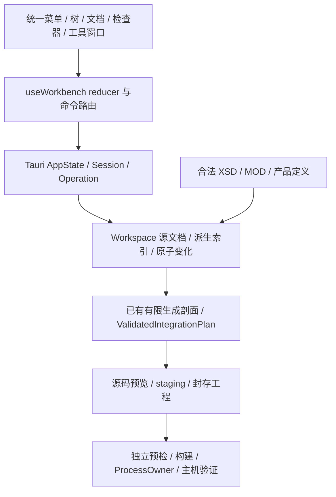

# Architecture Spine — R5 统一 ECU Configurator

## Design Paradigm

源文件支撑的事务式分层工作台。ARXML 原字节是配置权威；Workspace 派生对象／定义投影，Session 串行接受变化，React reducer 管理唯一交互上下文。定义编辑与生成剖面是同一输入的不同消费者，不用配置编辑权限推定生成能力。

## Inherited Invariants

[根架构](../../architecture.md)的配置原字节权威、唯一 Session／reducer、预览 fingerprint、受管进程、源／执行分离、合法外部档案与隔离原生验证保持约束。Epic 4 的 OS、输入／集成及 wire identity 不改写；本架构不是 Epic 4 子级，不重编号或复制其 AD。当前行为事实见 core/src/arxml.rs、arxml/persistence.rs、integration/graph.rs、integration/configuration.rs、generator/output.rs，src-tauri/src/workbench.rs 和 ui/src/workbench/useWorkbench.ts。

## Invariants & Rules

### AD-1 — 配置权威与投影 [ADOPTED]

- **Binds:** all
- **Prevents:** React、通用图或项目文件分别保存另一份配置。
- **Rule:** Workspace 保留每个 Source 的 saved/current 原字节、逻辑来源和文件身份；对象图／定义索引／表格是可重建投影，不作为序列化权威。扩大现有 Workspace，不另建持久配置库。现有 CAN 和标准集成视图从同一源集合产生；未知有效内容不得因展示或编辑其他对象被重写。

### AD-2 — 能力分层而非全局资源门

- **Binds:** CFG-1.1, CFG-1.2, CFG-3.1
- **Prevents:** 缺 MOD、XSD 或 GCC 就无法进入工作台或检查输入；未校验输入被标为通过。
- **Rule:** Session 可以拥有无验证资源的 Workspace。打开、原文查看、源结构索引、原创模板建立不要求编译工具；先执行路径、大小、编码、良构／DTD实体检查。定义依赖字段分别要求已绑定 DefinitionCatalog；Schema 校验要求匹配 XSD；剖面校验／源码准备要求该剖面真实所需资源；原生执行另要求宿主、目标、工具链。Reply 的 capabilities 增加按动作的 available/reason 与实际 validation state，不以一个 disabled 推断全部能力。没有资源时所有未执行验证保持 not_run，不缓存假成功。

### AD-3 — 一套对象身份

- **Binds:** CFG-2.1, CFG-2.3, CFG-NFR-2
- **Prevents:** 显示名／路径改动定位错误、旧草稿被应用到重开后的对象。
- **Rule:** 后台分配不透明字符串 workspaceEpoch、sourceId、objectId、fieldId；sourceId 属于明确源集合，objectId 是实例身份不是 SHORT-NAME/path，fieldId 标识实例的具体值条目。既有对象在同一 Workspace 的改名／字段修改中保留 objectId，新增对象获得新 ID，删除 ID 不复用；重开或切换工程更换 epoch。路径仅用于显示与解析诊断。ChangeSet.inputFingerprint 指当前 capabilities.fingerprint，由 AppState::begin 核对；Reply.inputFingerprint 仅回显此次请求身份，不是下一次可写 token。每次发布以后取返回 capabilities／projection 的当前 fingerprint 继续请求。树／表／引用／问题／草稿用同一组身份，禁止 UI 生成另一套业务 ID。

### AD-4 — 定义描述配置，不替代生成语义

- **Binds:** CFG-2.2, CFG-3.1, CFG-4.1
- **Prevents:** 从 VALUE 猜类型、从 MOD 存在推断支持模块生成。
- **Rule:** DefinitionCatalog 从合法且核对身份的 R24-11 MOD／用户明确注册的同版模块定义，以及产品原创定义读取；每份定义绑定来源摘要、版次和定义路径，冲突定义不自动择一。初始可编辑种类为非变体条件的 integer/float/boolean/enumeration/string/function-name/reference；描述符包含基数、范围、枚举、单位、默认值来源、目标 kind、可写性和原因。未支持的表达式、variation point、条件基数、instance-reference 语义及未确定版次只读／诊断，不用默认值补齐。普通引用遵守定义目标与实际 DEST。生成仍调用现有有限剖面；未实现模块只有配置能力，相关未解释消费对象阻断该目标生成，非相关保留内容不被静默删除。XSD 合法与定义合法分别报告，不代替 SWS／目标规则。

### AD-5 — 原子 ChangeSet 是唯一配置变化入口

- **Binds:** CFG-2.2, CFG-2.3, CFG-2.4, CFG-NFR-1
- **Prevents:** 逐项 IPC 造成部分修改、引用改名失配或全局字符串替换。
- **Rule:** ChangeSet={workspaceEpoch,inputFingerprint,definitionFingerprint,changes[]}，具体 wire 联合与 prepare/apply 绑定见下节。后台先解析全部目标及冲突，在 prospective graph 中计算结构／引用影响闭包和已知配置约束，按原文范围生成补丁并重建索引；合法候选一次发布、revision 只推进一次。失败按 changeId／字段返回问题，旧 Workspace 不变。新增和恶化约束拒绝，允许保留完全未变的旧违规见 Validation scopes；未知生成语义不是禁止全部安全修复的理由。改名同时更新全部可核定入站引用；移除未在同批解决的入站引用拒绝。无法确定受影响引用／变体或保持未知内容时拒绝，而非猜测。

### AD-6 — 保存与原文读取 [ADOPTED]

- **Binds:** CFG-2.5, CFG-NFR-1
- **Prevents:** UI 写任意路径、旧预览覆盖外部改动、Schema 状态冒充保存状态。
- **Rule:** 原文获取只接受当前 sourceId＋fingerprint，从 Workspace snapshot 读取，不接受任意绝对路径。源安全保存继续使用 PreparedSave／原文摘要／create_new staging／备份与恢复；manifest 的成员变化与源集合保存进入同一确认事务。确认绑定 before/current bytes、路径集合及外部状态；外部修改或未恢复备份拒绝。未修改文件不写；不能恢复时保留可恢复备份及具体状态，不返回 clean。保存所需验证按 Validation scopes 判断，不能将 target-generation 错误当成源保存门，也不能吞掉实际 Schema 错误；未执行验证永远 not_run。

### AD-7 — 可搬移的工程成员与原创模板

- **Binds:** CFG-1.2, CFG-1.3, CFG-4.2
- **Prevents:** 个人绝对路径、模板覆盖或项目文件成为可伪造的生成计划。
- **Rule:** 新工程使用 workbench-project.json v1，保存 formatVersion、declaredRelease、profileHint 和有序 inputs[{path,roleHint}]，以及显式 applicationInputs[{path,producerSlot}]；后者只列用户源成员，不存代码、参数或通过状态。路径为工程根下唯一相对路径，拒绝绝对路径、..、链接逃逸、角色／producerSlot 冲突；applicationInputs 仅允许所选剖面实际声明的应用槽。hint 不可信：按实际源集合及资源重识别、校验剖面，Schema 只作用 ARXML，应用成员读取为不执行的原字节。直接多文件 ARXML 打开仍支持原路径，未建立 manifest 的输入集合不强行复制；显式“保存为工程”先预览复制到新空目录，重复目标文件名拒绝或由用户明确命名。模板 ID 为 can-empty-v1、can-signals-v1、standard-ecu-v1，均为产品原创输入，不附官方包、密钥或构建结果；用户应用槽仅初始化一次。实例化替换合法工程名／引用，核对目标全部不存在后由 owned staging 建立完整集合，失败不留下误认成功的部分工程。原交接格式不按 manifest hint 旁路验证。

### AD-8 — 一个工作台状态与公共命令路由 [ADOPTED]

- **Binds:** CFG-2.1, CFG-3.2, CFG-NFR-2, CFG-NFR-3
- **Prevents:** 多棵竞争树、标签卸载丢草稿、菜单绕过保护、晚结果覆盖新上下文。
- **Rule:** 复用 useWorkbench reducer、call epoch／fingerprint 与 AppState Operation；分解内部 UI 模块而不新增 store。草稿按 epoch/objectId/docKind 或明确批次拥有，表面不拥有配置副本；菜单、工具条、树和快捷键共用动作及能力原因。对象／编辑上下文替换用“应用并继续／放弃草稿／留在原处”；工程替换、重开、两类交接导入及退出用“返回并保存／明确放弃／取消切换”，必须完成全部草稿应用、保存预览与确认才能执行 pending replacement，应用或保存失败不继续。非破坏面板／主题切换保留草稿。问题定位按真实身份，未知目标保留详情；校验结果不因导航消失。长任务使用现有归属和串行 mutating gate，取消先失效再等待 ProcessOwner 实际关闭，失败保持恢复入口。

### AD-9 — 独立验证、生成与拥有权 [ADOPTED]

- **Binds:** CFG-4.1, CFG-4.2, CFG-NFR-4
- **Prevents:** 通用编辑器绕开有限目标 grammar、生成自动编译或覆盖用户算法。
- **Rule:** 实际输入识别及验证选择剖面，ambiguous/mixed 不回退为 CAN；保留 legacy CAN、epic4-win64-sr-cs-v1 和 Windows/Linux target contracts。ValidatedIntegrationPlan 拥有已验证生成关系，不是缺资源浏览的唯一图。生成消费已保存输入／应用快照、资源身份、目标、目录及交付种类，只安装预览字节。拥有权与 sealing 按下节 workbench-ownership.json v1 契约由预览、staging、生成、构建、交接与离线验证共同消费；旧 wire format 不改语义、不自动升级。用户 live 应用不进入生成器可写集，封存副本不可变。未知拥有权／版本、工具拥有文件改动和未核定升级拒绝，合法移除只来自可核定旧 ledger。编译器不参与源码准备；预检、构建、主机行为仍独立。R6 沿相同应用槽与拥有权接缝扩展，不引入第二套保存或 integrity 规则。

### AD-10 — 外部资源与设置生命周期 [ADOPTED]

- **Binds:** CFG-3.1, CFG-3.2
- **Prevents:** 官方包再分发、资源缓存身份漂移、类别草稿串写。
- **Rule:** 继续使用已核定 XSD/MOD 摘要和外部合法路径；新增模块定义需明确注册同版来源、核对摘要及冲突，不能信任 schemaLocation 自动联网。每个相关 snapshot 绑定 xsd/mod/definition/catalog 身份；索引按这一身份缓存，不按路径本身缓存。资源替换使相关编辑草稿的应用身份失效并保留输入供核对，预览和下游结果失效；工具／目标变化遵循现有保守失效，不偷保留旧生成通过。外观／资源／工具分别原子保存，环境覆盖优先且只读说明；失败不替换旧 Session 配置。主题 preference 为 light/dark/system；系统主题事件只改变有效呈现和图形灯位，不重建 reducer 数据。设置沿现有 app_config_dir、AUTOSAR_CONFIG_DIR 隔离方式，无网络账号或收费服务。

### AD-11 — 原生迁移、部署与证据 [ADOPTED]

- **Binds:** CFG-NFR-3, CFG-NFR-4, CFG-NFR-5
- **Prevents:** 只验静态演示、操作用户桌面、包依赖 checkout 或跨目标升级声明。
- **Rule:** 新壳层内嵌在现有 Tauri 包，不采用生产模拟 invoke、原型计时器或新服务进程。正式组件遵守根 DESIGN 与暂定 EXPERIENCE；通用编辑新增表面遵守其扩展接入契约。Windows/Linux 从私有隔离原生会话验证实际 IPC、发行包无 checkout 配置链和独立源码交接，复用 autosar_tooling desktop；macOS 保留实际受支持边界，无隔离宿主标为未验证。安装图形迁入 ui/public 和 src-tauri/icons 时同批移除旧身份引用，PNG RGBA 及明暗灯位同步；桌面 ICO/ICNS 用固定通用灯色，不假称 OS 自动适配。解析/校验/扫描不在 GUI 线程，继承 50 MiB 单输入、路径与 XML 防护，不为了新界面放宽旧检查。日志保留实际失败及 owned 输出，支持受管取消，不新增遥测、云后端或持久审计产品。

## Consistency Conventions

| Interface | Contract |
| --- | --- |
| ProjectProjection | epoch、inputFingerprint=当前 capabilities.fingerprint、后台给出的 definitionFingerprint、release/profile、sources/objects/diagnostics/validation/capabilities；object 的 parentId/sourceId/path/kind/definitionId/writable/reason 不构成第二权威；definitionFingerprint 绑定 MOD／原创／用户定义组成的整个 catalog，builtin-only 和无 catalog 情况也由后台发不透明 token，前台仅回显 |
| FieldDescriptor | fieldId、definitionId、kind、cardinality、unit/range/enum/default origin、current explicit value、reference target kind、writable/reason；区分 absent/default/explicit；wire 值为 {kind,lexeme}，整数／浮点不经 JS number 往返，后台按定义解析并拒绝非有限数／非法函数名，未改原 lexeme 保留 |
| ReferenceEdge | source objectId/fieldId、rawPath/DEST、resolved targetId 或 unresolved reason；targetId 只属于当前 epoch，不替代落盘路径／DEST；同一索引用于候选、入站影响及问题定位 |
| ChangeSet / outcome | 下节内部 op-tag 联合；prepare 返回完整影响及 changeRevision，apply 精确确认同一批次；成功返回当前投影、selectionId 和 createdIds 映射，拒绝不返回部分 success |
| Error / validation | 保留现有 Reply<T>{value,capabilities,inputFingerprint} 与原始错误码；新增结构化 diagnostic 统一 severity/code/message/remedy/sourceId/objectId/fieldId，不能仅解析中文字符串作为身份 |
| Apply / save / generate | 分别修改内存／写源配置／写独立源码；没有资源、未验证与不支持是不同原因，不能互换 |
| Settings | 现有文件兼容读取新增外观字段的默认值；不重置旧资源、工具或环境优先级。新增 manifest 是成员元数据，不是迁移旧配置的强制步骤 |

### Change wire 与确认

唯一 JSON 契约采用内部标签 `op`，所有身份／token／changeId 都是不透明字符串。ObjectRef 为 `{kind:"existing",objectId}` 或 `{kind:"created",changeId}`，后一种只引用同批 create-instance，禁止用临时 ID 冒充实际 objectId。FieldRef 为 `{kind:"existing",fieldId}` 或 `{kind:"new",object: ObjectRef,definitionId,entryKey}`；entryKey 是同批唯一条目键。ValueState 为 `{state:"absent"}` 或 `{state:"explicit",value:{kind,lexeme}}`，空字符串是 explicit，不等于移除。ReferenceState 为 absent 或 explicit 的 `{rawPath,dest,target:ObjectRef|null}`；expected 的 null 表示当前未解析旧引用，仍核对原路径／DEST以便修复；新 value 必须解析为合法 ObjectRef 并与 prospective graph 路径／DEST一致，不允许创建未解析引用。

- `set-value`：changeId、field:FieldRef、expected:ValueState、value:ValueState。
- `set-reference`：changeId、field:FieldRef、expected:ReferenceState、value:ReferenceState。
- `create-instance`：changeId、parent:ObjectRef、sourceId、definitionId、shortName；必需字段／子实例用同批 new FieldRef／created ObjectRef 填充，不能先发布不完整父对象。
- `rename-instance`：changeId、object:ObjectRef、expectedShortName、shortName。
- `remove-instance`：changeId、object:ObjectRef、expectedShortName。删除字段／引用条目使用对应 set 操作 value=absent，非删除实例。

所有 changeId／entryKey 唯一；冲突修改、循环创建依赖或引用不存在的 create 拒绝。后台对完整 prospective graph 求值，先创建实例、再值／引用与改名、最后移除，但不得改变请求声明的预期旧值或冲突语义；新对象／字段 ID 只在成功发布后分配，返回 createdIds[{changeId,objectId}]、createdFields[{entryKey,fieldId}]。现有与将来接入的操作只按真实实现 capability 暴露，不预留可点击 no-op。

`prepareChange(ChangeSet)` 不改变 Workspace 或磁盘，返回 `{changeRevision,inputFingerprint,definitionFingerprint,impacts,diagnostics}`；changeRevision 后台绑定规范化全部 changes、源／目录／定义身份和实际展开的入站补丁。`applyChange({changeSet,changeRevision})` 在 existing gate 内重新核对全部身份、规范化批次及影响，再精确发布；草稿内容改变即清除确认，不能因 Workspace 没变而复用旧 changeRevision。预览内的新对象只使用批次键／路径，不能提前宣称已存在。

### Validation scopes

每条诊断属于 `source-safety`、`schema`、`definition` 或 `target-generation`，同时携带后台 ruleId、stable subject IDs、约束与反例 witness；前台不得从错误文本重分类。definition 包含类型、结构、引用及已注册的可编辑配置规则（例如 CAN 位段／周期一致性），target-generation 包含有限 grammar／消费能力及接口闭包。

打开检查必需 source-safety；编辑 prepare/apply 比较 before/after 全部已可核定 definition 规则，不只检查显式字段：before witness 的 ruleId／subjects／规范化约束与反例全部未变可保留，新增或改变 witness（含同 code 的恶化）拒绝。显示路径／文案不进入 witness 身份；外部或未支持关系影响不能确定时拒绝该变化。已有 target-generation 错误只保持目标阻断，不作为编辑或源保存前置条件。

保存必需 source-safety、合法编辑事务、原文／磁盘身份和恢复状态；若匹配 XSD 可用，完整运行 schema 并拒绝任何实际 Schema error；若 XSD 缺失，明确 schema=not_run 并允许源安全未校验保存。未改旧 definition 问题可保留并报告 blocked，不继承 clean 校验。生成必须运行其所需完整 schema/definition/target-generation 检查且全部满足，不扩大任何原有限生成 allowlist，不把保存门放宽升级为可生成。

### Ownership 与 sealing

新 R5 输出使用 `workbench-ownership.json` v1：`formatVersion`、`producerVersion`、`profileId` 和 `files[{path,owner,producerId,sha256,snapshotOf?}]`；owner 为 AD-9 的固定六类，path 唯一、相对且受目录约束。live user-application 在项目 applicationInputs 中，永远不属于生成输出可写集；输出中的该 owner 是 immutable snapshot，snapshotOf 指向已声明源成员而不是作者绝对路径。生成身份纳入当前用户应用原字节摘要，显式初始化只创建尚不存在的 live 源。再生成从已声明 live 源做新快照，旧 sealed application copy 被改动则冲突拒绝，不能将它当成 live 源或覆盖用户改动。

全部封存 payload 与 ledger／应用快照进入既有 files.list/files.sha256 的严格闭包，保持既有 seal metadata 自排除规则；ledger.files 只记录 payload，不记录 ledger 本身或 files.list/files.sha256，避免自摘要循环。build／离线 verify 消费同一不可变 seal。旧 ledger 必须通过 seal、路径和所声明 producer/profile 的已知拥有权策略核对，不能接受用户改 owner 作为写权限；新拥有权来自当前 prepared plan，移除只来自核定旧 ledger。版本／owner／producer／路径未知拒绝。applicationInput producerSlot 只允许当前剖面公开的已有接口槽，不自动接受新组件／连接或生成业务算法。源码准备只证明输入／接口契约与输出来源，用户算法正确性仍需显式构建和行为验证。

携带 R5 成员和应用输入的新交接格式为 `autosar-workbench-handoff-v2`；携带 project manifest、原始 ARXML／用户应用输入、ownership ledger、固定依赖与 seal，读取时重新识别剖面及来源并验证再生成快照，不能从 ledger 信任配置或接口。现有 `autosar-host-handoff-v1`、`autosar-ecu-handoff-v1` 与无 R5 ledger 的既有输出保留原完整性及 source compatibility 分派：允许原范围读取／构建，不能无确认覆盖为 v2；用户需选择新空目录明确生成新格式。实现须同批迁移预览、staging、构建、交接、重导入与包内离线工具，不靠关闭旧 closure 校验实现“保留应用”。

v2 的 handoff.json 字段固定为 `format:"autosar-workbench-handoff-v2"`、`producerVersion`、`profileId`、`targetId`、`projectPath`、`ownershipPath`、`resourceIdentities`、`inputSnapshots[{logicalPath,packagePath,kind,sha256,role,producerSlot?}]`；kind 为 arxml/application。所有路径相对且属于核定包闭包，logicalPath 唯一、application producerSlot 与成员文件一致；受限档案只列身份、不列作者个人资源路径或复制档案。重导入在新私有工程目录重建 live 输入，重新识别、验证和生成，sealed 源永不直接转为可写应用树。

应用槽及实际源摘要属于 generation preparation identity；预览捕获 live 源字节，确认前核对未变，任何外部应用改动拒绝旧确认并要求重读／重预览。新输出不继承旧 build/run，通过状态随 app snapshot 改变失效；被修改的封存 snapshot 永远拒绝，不被“保留用户代码”当成豁免。

初始 application slot 固定为 `epic4-single-application-v1`，仅标准 ECU 单实例 S/R＋同步 C/S 剖面公开；CAN 剖面没有用户算法槽，不造接口。模板／投影／prepared plan 返回同一 ApplicationSlotDescriptor={producerSlot,componentPath,sourcePaths,generatedHeaders,entrySymbols}，路径及 symbols 从已有 component_contract_files／已验证计划产生；前台仅选择／回显，不硬编码 RTE 名称。原产品参考实现可在模板初始化时成为 live 用户源，其周期／同步服务接口保持当前契约；未知槽、多个应用实例或新增接口拒绝，留给 R6。

故事推进保持可独立使用：7.6 的默认模板只创建 ARXML 与成员信息，applicationInputs 为空，标准模板仍可使用既有产品参考应用的生成路径；不要求尚未实现的拥有权接口。7.10 才提供显式“初始化用户应用”并在一次源事务中建立 live 源与成员记录，进入上述 snapshot/v2 链。SlotDescriptor 为后台数据，不是早期可点击占位动作；原模板生成能力不能因为预留后续功能而被关掉。

## Stack

继承锁定依赖，不选新框架或升级；实际版本由对应 lockfile 维护。此表是 2026-10-03 源码冷启动记录，不是最低版本或外部“最新”声明。

| Name | Version |
| --- | --- |
| React / React DOM | 19.3.0 |
| TypeScript | 5.8.3 |
| Tauri frontend API | 2.11.1 |
| Tauri desktop | 2.11.6 |
| Tauri dialog | 2.7.3 |
| Rust edition | 2024 |
| roxmltree | 0.21.1 |
| libxml | 0.3.21 |
| serde | 1.0.229 |

证据：ui/package-lock.json、src-tauri/Cargo.lock、core/Cargo.toml。运行时和受控工具链版本继承已有目标清单，不在 R5 重新绑定。

## Structural Seed

沿 core/src/arxml 与 integration 的实际解析／安全补丁提取可复用 Source/Definition 索引和 ChangeSet 能力；generator 继续消费有限计划，src-tauri 增量扩展现有 Session/Operation/Reply。UI 把现有 hook 内部职责分开，统一壳层承载已有编辑器与新增定义编辑文档。具体 Rust 子文件、内部缓存容器及 React 模块命名由实现拥有，禁止为尚无第二消费者的模块建立插件框架。

部署仍是本地 Windows/Linux 桌面包与各自 controlled target；原始工程、合法规范、独立输出、构建与私有日志目录物理分离。用户资源不嵌进安装包或模板；源码交接不带原机器路径。既有无 checkout 工具与封存工程协议复用，新增模板／成员元数据随实际输入一起交接。

## Capability → Architecture Map

| Capability | Governed by |
| --- | --- |
| CFG-1.1–CFG-1.3 | AD-1, AD-2, AD-6, AD-7 |
| CFG-2.1–CFG-2.5 | AD-3, AD-4, AD-5, AD-6, AD-8 |
| CFG-3.1–CFG-3.2 | AD-2, AD-4, AD-10 |
| CFG-4.1–CFG-4.2 | AD-1, AD-7, AD-9 |
| CFG-NFR-1–CFG-NFR-5 | AD-5, AD-6, AD-8, AD-9, AD-10, AD-11 |

## Deferred

R6 的连接／通信／调度算法、R7 诊断扩展、网络管理、硬件目标和其他版次保持各自路线；不能影响本轮 identity、源权威、编辑事务或用户源码归属。全局 Undo/Redo、崩溃草稿恢复、云同步与持久审计不在 R5。单故事的内部文件结构、索引实现、性能优化和控件实现可后定，但必须满足上述 Interface 与源安全行为。没有未记录的跨故事阻断决定；各模块实际 ECUC/SWS 约束由对应实现故事核对所绑定 R24-11 定义与既有有限目标，遇到未知规则必须拒绝或只读，不能默认支持。
