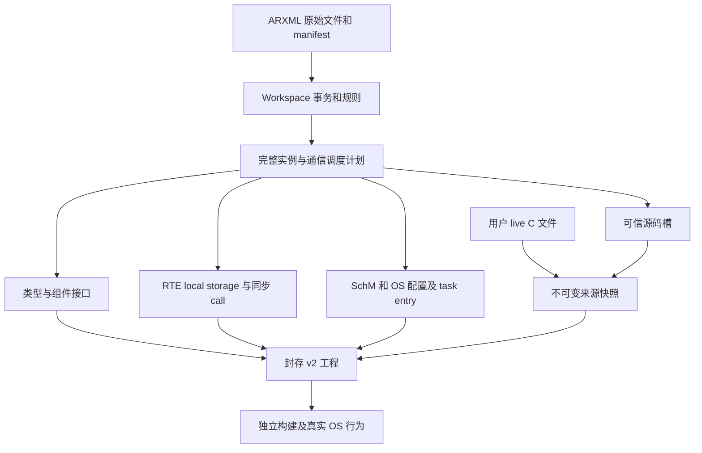

# Architecture Spine — 多组件应用与调度集成

## Design Paradigm

沿现有源文件支撑的事务式分层编译链扩展：原文→校验图→不可变集成计划→共同生成→封存交接。源码编辑与生成事务复用 Workspace；OS backend 是唯一 tick 与 task 调度裁定者。

## Inherited Invariants

根架构的原字节权威、确定生成、私有计划、受管执行和目标边界保持。Epic 7 AD-1、AD-3、AD-5、AD-6、AD-11 的对象身份、ChangeSet、保存、用户源码快照和 v2 完整性约束保持；初始单槽支持限制只对旧profile继续生效，本范围显式扩大multi profile。Epic 4 固定 OS backend／SC1 与 HostBatch tick契约不重新选型。Epic 7发行总状态不影响本范围进入，仅具体依赖失败阻塞相应story。

## Invariants & Rules

### AD-1 — 唯一计划与源权威 [ADOPTED]

- **Binds:** all
- **Prevents:** GUI、生成器和交接工具分别解释连接或持久化另一份配置。
- **Rule:** ARXML 原字节是配置权威；所有组件、端点、访问点、映射、符号、调度和源码槽在一份私有不可变计划中验证。消费者只读计划，不重新解析 XML 或补默认关系；失败无输出、无会话变化。纯local SWC不继承旧EchoApplication专属CAN／DID形状。

### AD-2 — 实例身份与首批组合

- **Binds:** CAP-1, CAP-2, CAP-3
- **Prevents:** 同短名或type与instance混用造成错误连接、调度或源码归属。
- **Rule:** component=(full type path, full composition prototype path)，endpoint=(instance, port, data element／operation)。保留三者各自身份和ECU映射；首批平坦组合、每个type一个实例、supportsMultipleInstantiation=false。嵌套／delegation／重复类型实例明确拒绝，不以代码复制或名称后缀假装标准多实例ABI。

### AD-3 — 本地 S/R 与网络传输分离

- **Binds:** CAP-2, CAP-5
- **Prevents:** 扇出互相覆盖、local写入被CAN停止阻断或同一R具有两个数据权威。
- **Rule:** 每个使用R endpoint恰有一个local P或network映射，P可扇出。连接接口及显式type mapping相容后，按producer endpoint建立local最后值与发布状态；首次发布前按各receiver明确ComSpec初值分别读取，冲突时receiver优先，缺init拒绝。首批local handleNeverReceived=false／aliveTimeout0／NONE，无invalidValue；其他freshness拒绝。本地标准Read／Write仅检查实际owner和指针，不检查CAN；网络适配独立处理Com状态／deadline。新multi按用户选择生成最小真实Rx I-PDU group、标准reception DM与COM→RTE通知，支持正数aliveTimeout；成员／handle／timebase／timeout／回调由同一计划核定。未分组Tx PDU按SWS_Com_00840隐式启动且不可停止，CAN停机不等于COM不可用；RTE仅按实际COM返回映射COM_STOPPED（SWS_Rte_06830／07822），Read仍回填last/init和freshness，Write更新缓冲，lower TX失败独立。标准COM模块拥有uint8 Send／Receive、lifecycle／status、真实PduInfo callbacks及MainFunction，必需ECUC配置明确核定；Rx／deadline不受旧host Dem策略失败阻断。旧profile保持历史gate／ABI。初始化在通信开放之前，运行仅owner串行修改。

### AD-4 — 同步 C/S 与服务器状态

- **Binds:** CAP-2, CAP-3
- **Prevents:** 直调server、参数方向漂移、周期调用服务器或两线程并发进入非重入实例。
- **Rule:** operation参数从声明方向／类型生成，uint32值IN、OUT／INOUT指针及byte[4] OUT以标准签名公开。调用仅通过组件Rte_Call进入可信目标，server在调用者owner上下文执行；每个调用方operation绑定唯一server／OperationInvokedEvent。接口操作、ComSpec和invoked event双向闭合；缺省/USE-ARGUMENT-TYPE为首批参数policy，USE-VOID拒绝；无参数operation保持void参数列表。调用环、async、并发与跨task配置拒绝；空OUT／INOUT拒绝且不改输出。首批无possible application errors，server entry返回void（SWS_Rte_08913），客户端Rte_Call返回Std_ReturnType，成功E_OK；两者ABI分别校验。

### AD-5 — 共同调度契约

- **Binds:** CAP-3
- **Prevents:** template另设周期、位置顺序不一致、漏掉第二组件或同tick重复执行。
- **Rule:** 首批每个周期runnable恰有一个TimingEvent，全部共用正整数ms周期、offset=0，映射到唯一Extended Task_Ecu合法OsEvent与所选Alarm／ExpiryPoint；应用/BSW周期mapping必须显式isMappedToTask=true并有task ref，缺省/false带task ref拒绝；合法显式零offset与缺省等价。所有使用event必须唯一映射，position唯一且排序，同runnable多TimingEvent拒绝。每个真实due tick按计划执行全部应用runnable一次，重复epoch不重跑；每个OperationInvokedEvent仍有RteEventToTaskMapping容器，RteEventIsMappedToTask=false且无task／alarm／event／position引用，不加入周期表。BSW输入／COM周期DM、应用、发送、诊断顺序保持；应用与COM周期状态保持同owner。真实异步CAN confirmation／mode callback涉及的CanIf、ComM、BswM共享状态以同一递归CAN资源的SchM exclusive area保护，BSWMD、声明、wrapper与source provenance共同闭合，不能以owner假设删除保护；应用跨owner配置仍拒绝。首批PERIODIC Tx PDU period与configured Tx main period相等。

### AD-6 — 接口及 profile 版本

- **Binds:** CAP-1, CAP-2, CAP-3, CAP-5
- **Prevents:** 全局同名Rte_Read冲突、旧工程ABI被静默改写或把类型等宽当作兼容。
- **Rule:** 新profile明确为singlecore-multi-swc-v1；每个type头呈现标准Rte_Read／Write／Call名称并映射到含组件身份的唯一实现符号。类型／方向来自模型；保留名、C归一化、case-insensitive路径与guard碰撞拒绝。旧profile、旧槽与旧handoff仍按原形状分派；必要ABI变化同步生产者／消费者／测试／交付资源，摘要不能授权兼容性变化。

### AD-7 — 每组件 live 源与 sealed 快照

- **Binds:** CAP-4, CAP-5
- **Prevents:** 用户owner字段授权任意输出、再生成覆盖代码或多组件交接遗漏来源。
- **Rule:** 可信plan派生每个槽的producerSlot／componentPath／sourcePaths／headers／entrySymbols；componentPath使用full type path，首批type与instance一对一。槽名为singlecore-multi-swc-v1:<full instance path>；live路径application/<checked type C name>.c对应sealed src/<same name>.c，case-insensitive碰撞拒绝。初始化create-only并与manifest原子接纳。每个live成员逐字节快照，output ownership由实际profile与槽重建；v2的application input数组允许多条，未知槽或路径拒绝。导入需seal、规则、catalog及实际source兼容，在新live目录恢复；sealed输出永不变可写源。格式字段若必须改变则显式版本升级，旧兼容检查不放宽。

### AD-8 — 编辑与确认失效 [ADOPTED]

- **Binds:** CAP-1, CAP-4
- **Prevents:** 连续IPC部分更改、外部源码变化后确认旧预览或旧构建冒充新结果。
- **Rule:** SWC／connection／mapping编辑扩展既有ChangeSet和原文安全补丁，前端回显后台身份。确认绑定全部ARXML／manifest／live C／规则／catalog当前字节，任何外部变动拒绝旧确认；生成改变使后续build／run结果失效。 UI复用既有对象、检查器、问题焦点和源码入口，按真实需要扩展DTO及i18n。

### AD-9 — R11 接缝与目标边界

- **Binds:** CAP-5
- **Prevents:** 应用uint32、短名或controller0变成未来CAN通道／类型权威。
- **Rule:** 本地endpoint、应用／实现数据类型、network／channel／SystemSignal／ComSignal／PDU／frame分开保留并交叉验证；wire width／endianness不代表应用类型。仅当前11-bit Classical CAN单通道实际行为；29-bit、FD、signed、multi-channel与其他转换输入拒绝。本次保留模型接缝，不生成R11运行支持。

## Structural Seed

复用core/src/integration、arxml、generator/delivery和现有runtime/ecu OS路径，未增加框架／依赖／外部服务。部署为现有Windows／Linux controlled host；compiler／官方oracle属于开发验收环境，不是配置／源码生成前置。输入、live源码、sealed输出、build和私有日志目录分离；硬件、硬实时、认证和原生GUI未运行范围单独标注。

## Capability → Architecture Map

| 能力 | 主要落点 | 约束 |
| --- | --- | --- |
| CAP-1 | source graph／Workspace／plan | AD-1, AD-2, AD-6, AD-8 |
| CAP-2 | component headers／RTE／local storage | AD-2, AD-3, AD-4, AD-6 |
| CAP-3 | event mappings／SchM／OS target | AD-1, AD-4, AD-5 |
| CAP-4 | source init／generation／ownership／reopen | AD-7, AD-8 |
| CAP-5 | legacy dispatch／communication seams／tests | AD-6, AD-7, AD-9 |

## Deferred

同type多实例共享代码／instance handle ABI、嵌套及delegation、不同周期／offset、更多event与类型、queue／mode／async／跨task同步：输入明确unsupported，消费者立项时按R24-11扩展独立验收，不能影响已支持配置退出。R11运行实现、R10硬件证据、Epic7发行收尾属于各自任务。内部Rust结构与控件布局由实现拥有，受以上身份、接口、顺序与来源约束；不预造plugin框架或未来profile容量。
