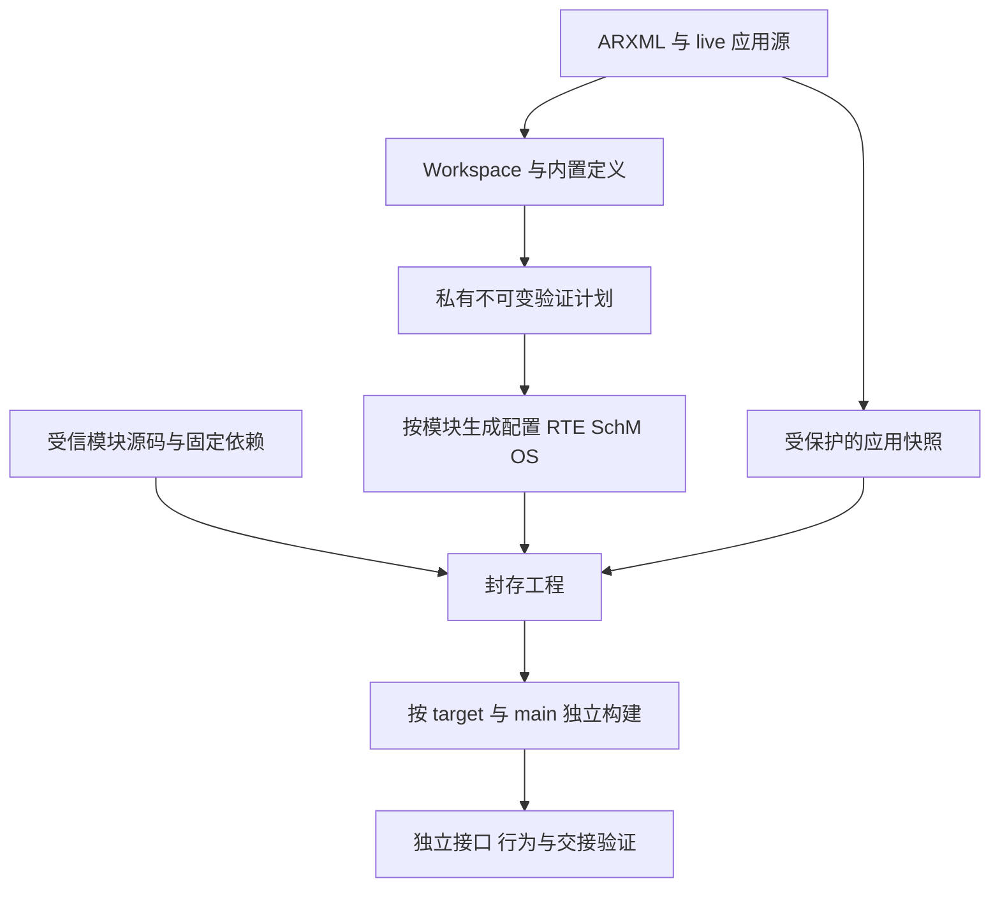
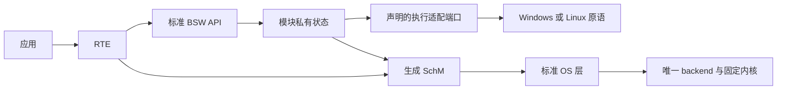

# Epic 9 增量架构契约

## Design Paradigm

沿现有分层编译链采用端口与适配器：源文件与配置语义由 Rust 核心拥有；C 模块拥有运行状态；主机平台原语位于适配层。基线、迁移 seed、工作包及未核查边界见 [BASELINE](BASELINE.md)。本文件定稿只表示架构材料完成，不表示整改、Story 就绪或标准符合。

## Inherited Invariants

继承根 [architecture.md](../../architecture.md) 当前整改约束；历史 Epic spine 保持只读，不将历史范围扩张为当前符合声明。这里的引用 ID 带原 Epic 命名空间，本文件 AD ID 仅属于 Epic 9。

| Inherited | From parent / existing constraint | Binds here |
| --- | --- | --- |
| Epic 4 AD-1、AD-2 | [Epic 4](../epic-4/ARCHITECTURE-SPINE.md) | 原字节权威、输入角色与唯一验证计划 |
| Epic 4 AD-6、AD-8 | 同上 | 唯一 FreeRTOS backend、汽车状态、受控 tick 和调度边界 |
| Epic 4 AD-5 | 同上 | 完整 SC1 等级义务、真实执行栈与 ARTI，不缩为参考对象子集 |
| Epic 4 AD-7 | 同上 | 目标、工具链、许可及独立证据 |
| Epic 7 AD-1、AD-3–AD-6、AD-9、AD-10 | [Epic 7](../epic-7/ARCHITECTURE-SPINE.md) | 对象身份、定义与语义区分、ChangeSet、安全保存、源码拥有权及规则身份 |
| Epic 7 AD-2 | 同上 | 内置配置能力不依赖用户官方档案／编译器，按动作报告能力与执行范围 |
| Epic 7 AD-8、AD-11 | 同上 | Session／reducer 状态权威、正常部署及隔离原生验证 |
| Epic 8 AD-1–AD-9 | [Epic 8](../epic-8/ARCHITECTURE-SPINE.md) | 实例与端点、local/network 区分、同 owner 调度、profile ABI、每组件快照及 R11 接缝 |

## Invariants & Rules

### AD-1 — profile、target 与程序闭包 [ADOPTED]

- **Binds:** QLT-1、QLT-2；资产选集、生成及离线构建。
- **Prevents:** 目录合并抹掉旧语义、同名头文件误选、多个 main 混合链接或 Windows 结果替代 Linux。
- **Rule:** legacy host、单组件 integration、多组件分别按实际 profile 身份分派，target 独立选择；保持各自标准／历史接口及策略，不同时链接互斥 OS／RTE／BSW producer。封存 target 的 source/include/宏/patch/main 清单是构建与分析共同输入。host、host-batch、probe、test 的实际程序闭包分别核验；六种 CI 样本是最低覆盖，不是所有支持配置。新增或改变选集须同步正常样本、模式测试与交付清单。

### AD-2 — 模块状态与接口边界

- **Binds:** QLT-1–QLT-3；BSW、OS、RTE、ECU 与 host adapter。
- **Prevents:** 两模块拥有同一可变状态，拆文件后丢失锁协议，标准公开头文件吸入 host／测试控制。
- **Rule:** 每个协议模块拥有自身状态和静态配置引用；RTE 拥有 local 数据及初始／发布状态；OS/backend 拥有调度，ECU adapter 拥有批次 admission、队列与收据。标准公开面、模块私有声明及 host 注入／时钟／输出分别组织；私有状态不向应用暴露。标准上下层回调依模块专用声明连接；真实异步 CAN、CanIf、ComM、BswM 共享状态沿既有 SchM exclusive area 保护，不能以 owner 假设取消锁。BSW 不新增直接平台线程或 FreeRTOS 依赖；资源通过已声明适配边界提供，故障控制只在测试构建。

### AD-3 — 单一语义来源与模块 emitter

- **Binds:** QLT-2；配置模型、内置定义、Rust 渲染器及 C 模板。
- **Prevents:** 渲染器重新解释配置、字符串修补形成第二套语义、ABI 类型与配置表漂移。
- **Rule:** ARXML／manifest 保持持久权威，定义描述合法结构，验证计划核定语义和身份；emitter 只消费计划。按模块组织配置、公开类型、回调、BSWMD、MemMap 和 producer/consumer 生成，保留确定顺序。COM→RTE 等跨模块 callback／类型／配置 glue 的唯一 producer、符号、声明和消费路径由对应契约一次核定，其他 emitter 只引用；相关 Story 进入前共同独立 consumer 必须编译链接闭合。将决定配置／接口的最终 C 文本搜索替换逐步移入结构化计划字段及模块 emitter；纯占位模板渲染可保留。资产来源到交付路径必须显式映射并拒绝碰撞、遗漏或多个 producer；普通生成不运行编译器或读取官方档案。

### AD-4 — 兼容迁移是一个完整变更

- **Binds:** QLT-2、QLT-3；调用方、用户源码、ABI、资产与离线工具。
- **Prevents:** 只改输出、不改来源；用摘要更新追认接口变化；再生成覆盖用户代码或封存包静默升级。
- **Rule:** 每次模块迁移先有独立接口／行为护栏，再同步源码与模板、配置语义及定义、所有调用方、清单与正常测试。保留 live/sealed 分离、create-only 初始化、预览确认失效、所有权和完整性拒绝。纯源码位置变化可保留既有 profile；任何公开签名、布局、句柄语义或 wire 变化先给出兼容分析，另行审阅并按需要新版本／显式迁移，未获授权不得实施。旧封存包按旧版本和 seal 校验，不重写摘要或放宽 reopen；新版本不以重命名旧接口宣称标准化。

### AD-5 — 标准与诊断的证据边界 [ADOPTED]

- **Binds:** QLT-1、QLT-3；标准研究、自动检查、人工审查和采用代码。
- **Prevents:** 绿色 CI、编号库存、扫描完整性或标准名称被当作符合性；第三方代码自动排除。
- **Rule:** 固定 CP/FO R24-11、MISRA C:2012 Third Edition＋AMD1–AMD4＋TC1–TC2 与 C99。每个模块按支持配置核对 SWS、ECUC、通用 BSW、条件适用描述／MemMap、公开接口及全部直接上下层义务。诊断分别核定真实违反、误报、不适用与未核查；原始结果保留，221 项人工 assessment 不能由工具可用性关闭。固定内核／port／patch 纳入实际责任链；无法消除真实违反或缺合法依据时阻塞对应退出，禁止批量 suppression、规则降级、缩小既有支持；本轮无偏离批准。

### AD-6 — 独立预期与正常开发入口 [ADOPTED]

- **Binds:** QLT-4；快速反馈、模块、生成、进程、原生与交接验证。
- **Prevents:** 测试复写被测实现、删除不同风险覆盖、仅 mock／构建成功替代真实操作。
- **Rule:** 用现有 npm、Cargo、uv、autosar_tooling 与离线 ecu-tool 入口；按改动选择检查，完整出口再覆盖全部受影响层。标准预期从固定原文与独立向量定义，ABI 清单只能验证内部一致性。模块契约覆盖初始化、成功、拒绝、超时／恢复、重复调用、失败后字节与输出保护、实际并发路径；维护旧 profile 行为。数据、build、进程、桌面及日志隔离，前置工具先核对，缺条件明确未执行。native／IPC、安装包、离线接收者和硬件结论分别取证；只证明相同风险覆盖后才删除重复测试，不另建代理编排。

### AD-7 — 完整源码门禁与性能基线

- **Binds:** QLT-5；Actions 分组、缓存、聚合与分支保护。
- **Prevents:** 丢样本换速度、旧扫描结果缓存为通过、非必需状态无法阻止合并。
- **Rule:** 保留两平台六样本与每个实际 main 的分析闭包，每次生成和分析本轮输入；缓存只复用可信依赖／构建中间物，按 runner/target/toolchain/source identity 隔离。严格门禁同时要求完整选集、error=null、passed=true、上游全部 success；缺失、重复、skip、cancel、工具／解析失败均不能通过。整改完成后将严格检查接入每次 PR 的 c-analysis 聚合，并将其加入必需分支状态；用故意违规、缺样本和工具失败的实际 PR 验证阻断，再恢复干净输入。优化用可比完整运行的 job/step、队列、缓存命中、稳定性及资源消耗评估，不预承诺百分比或只延长超时；新增门禁成本与优化收益分别按同覆盖、同工具身份核定，说明合计变化与差异原因。

### AD-8 — 分阶段退出与依赖 [ADOPTED]

- **Binds:** Epic 9 工作包、Story 拆分与 R11 进入。
- **Prevents:** 为未知数量生成空故事，单模块通过冒充 Epic 出口，人工问题集中延期。
- **Rule:** [BASELINE 工作包](BASELINE.md#迁移工作包与-story-进入)固定范围和依赖；每个模块包先补对应规范与独立预期，再实施来源／调用链／资产迁移，伴随 MISRA 核定和人工审查。测试／性能调查可独立并行；共享 API 变更由一个包拥有，消费者待该契约固定后迁移。严格门禁、兼容审阅和非实现者新目录复验全部通过才关闭 Epic 9，R11 消费者实施等待本出口；研究可提前。规格状态和标准结论分别更新。

## Capability → Architecture Map

| 项目需求 | 落点 | 约束 |
| --- | --- | --- |
| QLT-1 范围／标准 | profile-target-program 来源、模块与合法资料 | AD-1、AD-2、AD-5 |
| QLT-2 组织／来源 | 模块 emitter、私有头、host 边界、完整迁移 | AD-2–AD-4 |
| QLT-3 整改／人工 | 源诊断分类、采用代码及未核查出口 | AD-4、AD-5、AD-8 |
| QLT-4 开发／测试 | 正常入口、独立预期及隔离 | AD-1、AD-6 |
| QLT-5 CI | 完整分析、缓存、严格必需门与耗时复验 | AD-7、AD-8 |

## Structural Seed

具体建议见 BASELINE：先复用现有 runtime/src、runtime/multi、runtime/host、runtime/ecu、runtime/os 和 integration，按职责分离公开／私有／host 头与生成器；目录改名不独立构成成果。未改变 Rust／React／Tauri／Python 技术栈或固定内核。部署仍为 Windows/Linux controlled host，无新增服务、provider、常驻代理、联网运行依赖。应用安装依赖、ECU 构建工具与官方研发资源分别保持既有入口；本轮不改安装、运维或 UI。

## Deferred

- 模块内精确文件粒度由其 Story 在调用链证据下确定，必须遵守 AD-2/3；不预建所有可选模块目录。
- 合法规范全文获取、模块完整适用性、诊断分类及 221 项人工审查是后续进入与退出依赖，见 BASELINE 未核查项；不能用本架构定稿解除。
- 标准化引起的实际 ABI／profile 新版本及迁移格式，待对应模块完整契约和兼容审阅后确定；在此之前只允许兼容整理与设计，不允许静默改变旧契约。
- CI 是否新增更细分组，待阶段日志和成本证据确定；CTU 不拆散同一程序，样本／目标／main 不减少。
- MCU、真实硬实时、真实 ISR／段放置、完整 NM／CanSM、新类型及通道由各自后续增量处理；已支持配置中的通用软件义务不得据此延期到 Epic 10。
