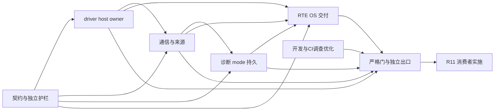

# Epic 9 基线盘点与迁移依据

本材料供后续规格与 Story 拆分使用；约束由 [ARCHITECTURE-SPINE](ARCHITECTURE-SPINE.md) 固定。本轮只盘点与设计，不登记整改完成、Story ready-for-dev 或标准符合，不修改产品源码、测试、CI、资产摘要或分支保护。

## 基线与证据等级

2026-10-10 获取 `origin/master` 后，当前工作树 HEAD／远端均为 `a09955c7efdd276c9e19e50feb867949ca331eb8`，左右差异 0/0，初始无改动；包含规划 PR #19 及 Epic 8 整改 PR #18。沿用现有 `t3code/epic9-runtime-codegen-architecture` 工作树，不改用户分支或主工作区。当前规划依据为[变更提案](../../sprint-change-proposal-2026-10-10.md)、[PRD QLT-1–5](../../prd.md#实机前工程质量要求2026-10-10)、[Epic 9](../../epics.md#epic-9-运行时生成-c-与开发工程体系整顿)和[当前进入条件](../../implementation-readiness.md)。

证据分为：**本轮确认**（实际源码、远端 API、CI 摘要／日志及官方检索内容）、**既有证据**（已合并规格／历史实际测试，未在本轮重跑）、**未核查**（不能从前两类推定）。当前完成了来源与机制盘点，未完成全部模块适用条款审计、逐诊断裁决或目标行为复验；它们是实施规格的真实进入／退出依赖。

## profile、target 与实际来源

模板 ID、集成 profile、交接 wire 和 target 是不同身份。不能用 `standard-ecu-v1` 模板名替换 `epic4-win64-sr-cs-v1` 历史集成身份，也不能从后者的 win64 名字推定当前只有 Windows。

| 已交付族 | 源与生成分派 | 行为／兼容边界 | 目标与正常覆盖 |
| --- | --- | --- | --- |
| legacy host | `generator/render.rs` 生成 Ecu_Config／回调；`runtime/src`、`include` 与 `host` adapter | 轮询 Os_Advance、固定 Rte_Read/WriteSignal；同步 sink 确认；256-byte 容量；可选诊断、写入、routine、DTC／NvM；Security 为 Windows BCrypt 专属 | Windows/Linux；CI signals、diagnostic、capacity；Security 和 routine 并非六样本全覆盖 |
| 单组件 integration | `integration/ecu.rs`、`contracts.rs`、`configuration.rs`，`runtime/ecu/templates`；复用旧 BSW 并生成接口桥 | 单实例 S/R 与同步 DID，实际 OS/backend owner；queued confirmation；64-byte 主机策略；保留历史 BSW origin 和类型桥，不能当完整标准接口 | Windows/Linux；standard-ecu 与 user-application；host-batch、probe、test 分别选择 main／宏 |
| 多组件 | `integration/multi*.rs`、`ecu::source_assets(target,true)`；`runtime/multi` 替换选定 BSW，复用 Can driver、OS、kernel | `singlecore-multi-swc-v1`；local S/R、同步 C/S、同 owner 调度、每组件 live/sealed 源；标准 COM、CanIf、路由与有界 mode 栈，非完整 NM | Windows/Linux；multi-component，接口和真实运行 suites；实际 main 与 target 不合并 |

实际选择依据：[source_assets](../../../../core/src/integration/ecu.rs)、[legacy 渲染器](../../../../core/src/generator/render.rs)、[multi emitter](../../../../core/src/integration/multi_ecu.rs)、[target](../../../../core/src/target.rs)、[资产库存](../../../../runtime/contracts/assets-v1.json)。multi 从 ecu 选集排除旧 BSW producer，仅保留共享 Can／Can_HostLock／Ecu_Status 等，再加入 ecu-multi 选集；这不是两个目录可无条件合并的证据。

Windows target 使用 PE/TLS、winmm／bcrypt、14 个受控 patch；Linux 使用 ELF／pthread、4 个 patch，其中三个按文件选择应用。工具链固定在 `runtime/os/toolchain*.json`：Windows MSYS2 GCC 16.1.0 Rev5；Linux Ubuntu GCC 13.3.0 与 binutils 2.42 的具体身份。FreeRTOS V11.3.1 commit `054e14f3397023aa83813a65aa065fc4597d481b`，内核与 Posix port 分别由 `third_party/freertos/*source-manifest.json` 固定，MIT 身份保留。工作台 Rust 1.98.1 由 rust-toolchain 固定。此处记录现有锁定版本，不升级或重新选型。

## 模块、状态与直接依赖

| 责任 | 当前来源与公共／私有面 | 状态与直接调用／依赖 | 迁移关注 |
| --- | --- | --- | --- |
| 共用 Can driver | runtime/src/Can.c、Can_HostLock.*；include/Can.h、Can_GeneralTypes.h、Can_MemMap.h | 控制器、pending TX/RX、复制帧、确认 token、interrupt nesting；CanIf callback、SchM_Can、Ecu_Execution | Can.h 混合标准服务与 CanTxSink、HostFlush、Inject 等主机面；拆声明时保护 queued flush／取消／迟到确认和递归锁 |
| legacy Com／CanIf／LSduR／PduR | runtime/src 与 include；PduR_Internal.h | Com 信号、valid/deadline、确认；EcuConfig、Dem、路由与 CanTp／Dcm；size_t／EcuStatus 等历史 ABI | 不将非标准 API 改名即算整改；独立标准门面／兼容 adapter 与配置迁移必须同时设计 |
| legacy CanTp／Dcm | runtime/src；Dcm_Internal.h；host/src/Dcm_Execution.c | 分段计时、FC、确认；Dcm active/pending session、S3、Security／Dem；execution adapter 为时钟和 admission 边界 | 会话只在 TX confirmation 提交；错误后恢复，不能合并时丢掉 legacy WAIT／DID 行为 |
| legacy Dem／NvM／Security | runtime/src、NvM_HostStorage.* | Com monitor→Dem→NvM；双槽、CRC、文件锁和落盘；Security session／seed／持久失败次数、BCrypt | 标准 Dem/NvM 与主机存储责任分别核定；保持损坏拒绝、写失败传播和密钥不交付；不能缩掉现有 Windows 支持 |
| multi Com | runtime/multi/src/Com.c、Com_Internal.h 与 include/Com*.h | 模块拥有信号值、Rx group／DM、计时；RTE 初始化／发布／freshness 与 network 映射独立；PduR 调用和生成 COM→RTE callback | 唯一 Rx owner、initial/last 状态、IMMEDIATE 配置、TX lower failure 与 COM_STOPPED 区分 |
| multi CanIf／LSduR／PduR | runtime/multi 源与按上下层命名头文件 | const 配置路由、独立上下层 PDU 命名空间、controller/PDU mode、TP 回调；Can driver 与 SchM | 标准 PduInfoType／PduIdType 签名，不混用 frame index；异步 confirmation/mode 的共享锁保持 |
| multi CanTp／Dcm | runtime/multi；模块 MemMap、生成 SchM／配置 | CanTp state／sequence／timer／lower pending；Dcm session、buffer 和 diagnostic admission；PduR、Det、ComM 与 RTE modes | Dcm、CanTp、router 句柄不互换；无应用 DID 的 F186／session 路由也是真实支持配置 |
| multi ComM／BswM／Det | runtime/multi；ComM_Internal.h、Det_Host.* | ComM requests/current mode/channel、diagnostic、wakeup、ECU lifetime classification；BswM pending／processing；SchM 与 host CDD BusSM 接缝 | 已交付有界 NM NONE／mode 行为；未交付完整 CanSM／Nm／CanNm。Det_Host 不是普通模块状态公开面 |
| RTE／生成配置／应用 | integration/contracts、multi_rte、multi_com、multi_mode、multi_ecu；ecu templates；每组件应用槽 | plan 核定端点、types、handles、period/phase；RTE 唯一 local last/init/published；应用 live 字节由用户拥有 | 不从 live 内容反推 ABI，不由 emitter 再定时序；参数名、宏和实际运行符号碰撞要在生成前拒绝 |
| OS／ECU owner／host | runtime/os 与 backend/host；runtime/ecu/Ecu_Target、HostBridge、Execution、SchM、Hooks | backend 唯一调度／真实栈；汽车对象状态归 OS；ECU batch lifecycle、epoch、ticket、output queue、receipt；host 原语不推进汽车时间 | 按状态所有者拆分 Ecu_Target，不能新增调度器；COMMIT_OK 必须等待 actual Waiting 且 input/tick/output/confirmation drained |

以上为当前代码责任图，不是模块标准审计通过。`runtime/multi` 的 ComM／BswM 实际存在，根架构“没有 ComM”等旧概述需修正，不能沿旧文字把直接依赖漏掉。当前多组件 mode 支持也不能提升为完整网络管理。

## 配置、生成来源与交付闭包

配置路径为 `arxml` 原字节／manifest → rules 与自有 definitions → integration graph／component／communication／schedule／routing／multi_bsw／plan → 私有 `ValidatedIntegrationPlan` → contracts／RTE／ECU emitter。模型与内置定义不是并行持久配置权威；ECUC 数值范围合法不能代替连续 controller/HOH 编号和实例数量语义。PR #18 的符号碰撞与同 event 周期／phase 整改已合并，不再登记为开放缺陷；其回归必须保留。

实际生成来源既有 `.c.in`，也有 Rust `format!`／拼接和已有资产的替换。`ecu.rs` 为单组件追加 Com 标准声明并保存 `bsw-origin/include/Com.h`；`multi_ecu::mapped_configuration` 等对最终 C 文本变换，且 multi Rte_MemMap 做目标段映射。这些是已确认的来源耦合点，**不是**已确认所有替换均错误。应将配置语义、类型和身份变换移到计划／模块 emitter；只表达文本的模板占位可保留，先独立证明字节／行为再删除旧路径。

`AssetInventory` 从编译时可信库存嵌入字节；`prepared`／`generator/delivery`／ownership／reopen 负责新目录发布、预览 revision、快照和所有权。`runtime/contracts/bsw-v1.json` 记录 17 个历史 host BSW 签名及来源，明确不是标准认证；不能当全部 multi API 的唯一标准预期。`assets-v1.json` 与 v2 tool 资产、FreeRTOS manifests、target 清单、files.list／files.sha256、integration/contract 元数据共同组成来源／seal；ABI 和第三方身份变更不能由 `assets update` 吸收。更新受信字节还须检查 `.gitattributes` 的固定换行。

离线交付入口 `runtime/ecu-tool.py`，实现来自 `tools/python/src/ecu_tools`，native wrapper 由 `generator/delivery/tools.rs` 生成并核对工具／包身份。接收者只需受支持 CPython、匹配 GCC/binutils 与 Git；不依赖 checkout／Rust／Node／uv。v1 精确重导入与 v2 内置规则交接分别处理；旧 sealed 包不重新盖章，用户 live 源不被再生成覆盖。源码整理若改变交付位置，必须同时核对 deliver_path、target sources/includes、headers、ownership/reopen 和封存工具，不只更新 repository 路径。

## AUTOSAR 与 MISRA：已确认和未核查

固定依据为 CP/FO R24-11；模块适用性按 profile、配置、公开面与直接依赖核定。以下是本轮核对范围，并非完整符合矩阵。

| 依据／角色 | 本轮确认 | 尚未核查与解除条件 |
| --- | --- | --- |
| CanIf 公共 API | 官方 R24-11 检索确认 Init 的 CanIf_ConfigType 配置指针（SWS_CANIF_00001）；legacy runtime/include/CanIf.h 仍用 EcuConfig；multi 头已使用 CanIf_ConfigType | legacy 其余标准服务、全部上下层回调、配置／可选服务条件须全文逐项核定；不能由 multi 同名接口推定通过 |
| 通用 BSW | 官方检索确认 SWS_BSW_00036 的跨模块头文件版本检查义务；当前所读 CanIf 头和 multi 模块无对应 version 宏／预处理检查，形成明确审计候选 | 核对全部模块、已生成头与适用 published information／排除条件，再给出范围内缺口裁决和独立拒绝编译用例 |
| Com、Can、路由／TP、Dcm、ComM、BswM、Det | 实际标准／历史接口分派、状态和生成配置已定位；[Epic 8 规范记录](../../../specs/spec-multi-component-scheduling/compliance-references.md)含固定官方摘要和已核定条款 | 既有记录不是本轮全文复审；所有必需 API、状态、错误、回调、BSWMD、配置语义和可选条件需在模块包闭合 |
| OS／RTE／MemMap | 固定 backend 和历史 SC1／应用契约继承；代码已有 OS/RTE/多模块映射头，主机 PE/ELF 段检查路径存在 | 旧证明不替代本次迁移复验；版本义务、生成物完整性、scope、段关键字与适用描述逐角色核定；MCU 实际放置未验证 |
| Dem／NvM／Security 与采用代码 | host 文件/锁/双槽与 BCrypt 边界、内核/port/patch 身份可读；第三方不自动排除 | Dem/NvM 标准公共面和存储链、security 的项目责任、采用代码真实违反和人工项逐包裁决；缺资料或无法消除时保持阻塞 |
| MISRA 修订 | 项目固定 200 Rules＋21 Directives；官方 AMD4 说明可与 Third Edition＋AMD1–3＋TC1–2 组合；c_check 固定 Cppcheck 2.21.0 与三个 addon 摘要 | 全文、例外和适用性并未逐项核定；自动 checker 可用不等于规则评估，当前每项 assessment=not_assessed |

官方可核对来源：[CanIf R24-11](https://www.autosar.org/fileadmin/standards/R24-11/CP/AUTOSAR_CP_SWS_CANInterface.pdf)、[BSW General R24-11](https://www.autosar.org/fileadmin/standards/R24-11/CP/AUTOSAR_CP_SWS_BSWGeneral.pdf)、[Memory Mapping R24-11](https://www.autosar.org/fileadmin/standards/R24-11/CP/AUTOSAR_CP_SWS_MemoryMapping.pdf)、[MISRA AMD4](https://www.misra.org.uk/app/uploads/2023/03/MISRA-C-2012-AMD4.pdf)。其他完整模块原文沿 [Epic 8 固定来源](../../../specs/spec-multi-component-scheduling/compliance-references.md)、[Epic 4 契约](../epic-4/R24-11-CONTRACT.md)及[既有质量研究](../../../../docs/research/autosar-platform/generated-c-quality-gates.md)定位；研究中条款／页码保持“既有证据”，不能自动升为本轮全文确认。

**资料限制：**本工作树和主工作区 R24-11 目录只有索引说明；历史 301/301 下载描述不是当前文件可用证明。`core/resources/official.json` 指定 XSD／MOD 路径与摘要，但本轮未提供这些原件，也未确认另一路径的合法正文。浏览工具直接打开 CanIf PDF 失败，终端下载因证书信任失败；保留 TLS 校验，不改主机信任、不提交官方文件。官方检索返回的指定接口内容足以支持上述局部核对，不能支持逐模块完整审计。后续模块 Story 应先取得合法固定原文、验证对应摘要及实际引用，MISRA 正文许可／可用性也必须独立确认；缺项阻塞相应标准裁决，不阻塞兼容源码组织设计。

### 本轮读回的完整源码分析

证据为 [a09955c 的 master CI 38038608981](https://github.com/g1331/autsaro/actions/runs/38038608981)，逐个下载 8 组 summary artifact、核对 12 个摘要；不是本轮本地重扫。所有 `error=null`、`passed=false`。以下为摘要去重后的原始 diagnostics 数，包含 checker／项目／采用代码等项，**不是独立真实违反数量**。

| 样本 | Linux unique TU／诊断 | Windows unique TU／诊断 | 实际分析程序 |
| --- | --- | --- | --- |
| signals | 21／238 | 21／296 | target |
| diagnostic | 21／244 | 21／302 | target |
| capacity | 21／238 | 21／296 | target |
| standard-ecu | 42／1814 | 42／1829 | host-batch、legacy-probe 各 41 TU |
| user-application | 42／1814 | 42／1829 | host-batch、legacy-probe 各 41 TU |
| multi-component | 52／2607 | 52／2552 | host-batch、legacy-probe 各 51 TU |

`c_check.py` 实际先按 target 检查宿主／compiler ABI、编译与系统宏，再按实际 main 划分 CTU 程序；同一公共 TU 在两个程序中的语义不能因 unique TU 统计而删除。该分析清单不等于 test 私有宏配置或全部 Security／routine／network-only 变体覆盖，应在受影响模块补充相关配置到正常测试／样本入口。样本扩充须保留现有十二组合，不能替换掉旧覆盖。

已知 checker 限制包括 R21.8 仍报告 getenv、终止函数清单缺 _Exit／quick_exit；既有 spec 还记录 fopen errno 模型差异、mmap／采用内核边界待核定。局部解释只是一项裁决依据，不批量关闭相似诊断。项目动态分配规则仅覆盖直接调用，主机线程边界规则也不是完整指令检查；授权正文、需求／设计追踪、跨 TU、资源／并发／生命周期、采用代码、所有工具未覆盖项和类别／适用性均需人工审查。

## 测试分层与有效覆盖

正常入口和环境细则由 [testing.md](../../../../docs/development/testing.md)、[CONTRIBUTING](../../../../CONTRIBUTING.md)维护，本材料不建立另一套命令权威。

| 层 | 当前正常入口／来源 | 有效证明与缺口 | 失败定位／隔离 |
| --- | --- | --- | --- |
| 快速 UI／Rust／Python | npm lint/test/build；Cargo 默认 tests；unittest discover tests/python；quality --base | 配置／计划／渲染／工具单元及前端逻辑；不证明真实 ECU、IPC 或安装 | 按 suite/filter 缩小；临时输入和唯一输出，不依赖代理状态 |
| 模块公开契约 | core/tests/multi_runtime_contracts.rs、multi_component_contracts.rs、fixtures/multi-runtime | 有界模块签名、状态、拒绝及部分并发；需补独立标准负例与遗漏适用服务，不能从 ABI 库生成唯一预期 | 编译并链接独立 C consumer；测试 SchM／故障适配仅在测试构建 |
| 生成／封存／模式 | core/tests/c_analysis.rs；native/test_ecu_build_modes.py；ownership/reopen 测试 | 六种真实源样本与 host/probe/test 选择、seal、外层 Git patch 隔离；不是完整 profile 变体行为 | 新空目录；错误工具／损坏 seal／源被改应拒绝；实际 patch 文件必须改变 |
| 进程与 host 边界 | tests/python/process；native/test_host_boundaries.py；Cargo native-tests execution | 超时／取消／子孙回收、锁忙／锁错、I/O 关闭失败；不证明所有模块竞态 | OwnedProcess 私有日志、单调 deadline、独立状态文件；保留真实失败 exit |
| C 分析 | autosar_tooling c-check --target --project --output-directory | 完整 TU／program／工具身份与原始诊断；人工 221 项、间接调用等不自动闭合 | summary/error、program 日志、compile_commands、dump、compiler probes；按 stage 定位，不吞错误 |
| 真实 OS／ECU 集成 | Cargo official-oracles、native-tests；26 OS suites；封存 ecu-tool build/verify | 受控 owner/tick、栈、事件、资源、CAN/DID、拒绝恢复；旧规格有实际结果，本轮未重跑 | 全部合法资源／工具先预检；每 suite 保存失败现场或既有 output-directory；Win/Linux 证据各自归属 |
| 原生 UI／IPC、包 | autosar_tooling desktop；desktop.yml／bundles.yml | 浏览器／mock 不能替代异步对话框、busy 解除、IPC；包可搬移／无 checkout 另验 | 私有桌面、Xvfb／namespace／Windows 隔离；等待实际可操作与事务完成，不用固定延时 |
| 独立离线接收 | ecu-tool verify；offline.yml；test_offline_delivery.py | stdlib-only receiver、seal、真实编译／行为与失败路径；不同 Python/target 按实际执行证明 | 无源 checkout／开发环境；外部状态与 build 新目录；工具身份错误不 fallback |

`checks.yml` 的 desktop job 实际是 Tauri Cargo tests，不是 GUI 驱动。acceptance、offline、desktop、bundles workflows 均为手动入口；当前 master 的 Development checks 绿色不能代替这些层。Windows Security、文件恢复、异步 TX、COM deadline、无应用 DID、network-only、不同配置编辑后来源识别与旧 v1 包等现有独立风险须在各包选集显式核对，不能以六样本数量证明“有效覆盖全部”。

开发优化先把“改动→已有检查／必需前置条件”整理到 testing.md，再按真实重复的风险与阶段去重。CI prepare 的 native 行为检查与 Python 默认 suite 并非同样执行范围，不因文件名类似删除；重复构建需凭实际阶段证明可复用。无需新增 runner、报告汇总或代理专用启动器。

## CI 实测、关键路径与严格门禁

本轮从 GitHub jobs API 读取三次 master 完整运行。秒数为 step/job `completed_at-started_at`，不含该 job 开始前排队；总时长为 run createdAt→updatedAt（含编排与排队）。不同提交与 runner 波动使这三次只构成观察基线，不构成稳定 benchmark 或优化收益。

| 完整运行／提交 | 总时长 | Win prepare | Win standard / user / multi jobs | Linux prepare / 最长 analysis job | 最长分组分析 step |
| --- | --- | --- | --- | --- | --- |
| [38031653568](https://github.com/g1331/autsaro/actions/runs/38031653568)／1a89f84 | 17m54s | 284s | 754 / 751 / 780s | 155 / 157s | Win multi 711s |
| [38035729747](https://github.com/g1331/autsaro/actions/runs/38035729747)／c326570 | 18m10s | 289s | 703 / 722 / 786s | 150 / 182s | Win multi 715s |
| [38038608981](https://github.com/g1331/autsaro/actions/runs/38038608981)／a09955c | 17m11s | 293s | 722 / 706 / 595s | 142 / 179s | Win standard 646s |

最新 prepare 具体：Windows compiler setup 43s、保存回归 48s、完整样本生成 56s、封存构建模式故障隔离 65s；Linux analyzer behavior 33s、保存回归 25s、样本生成 39s。最新 Windows analysis steps：standard 646s、user 639s、multi 527s、host 三样本合组 117s；Linux 分别 165s、168s、141s、42s。Windows 各分组还重复 compiler action 34–39s。主路径是 prepare 完成→最慢 Windows ECU 分组→c-analysis 聚合（6s），不是 UI／Python，也不能永久指定 multi 为唯一瓶颈。

当前 `c-analysis-samples needs: c-analysis-prepare` 依赖整个双平台 matrix：Linux 分组也等较慢 Windows prepare，形成可优化等待；需在既有 Actions 中评估按平台 producer 接线，保持聚合缺失／取消保护。最新 prepare 日志确认 Windows vcpkg、Cppcheck、Cargo 三缓存命中，Linux Cppcheck/Cargo 命中；不能把剩余耗时归因“没有缓存”。Cppcheck 缓存按 runner image 与固定 revision，Cargo 按 runner/toolchain/lock；旧 source analyzer 结果未缓存，仍重新生成并全量分析。

性能实施顺序：先用既有 stage logs 区分 compiler validation／macro probes／各 main 的 Cppcheck／addon 时间与 runner 排队；核对 c_check 已有最多 4 个 compiler worker，再评估重复 compiler 安装、可复用构建中间物和 producer 等待。不能将两个 main 的 CTU 合并，也不优先加 TU 分片；只有程序闭包与独立诊断不丢失时才改变并行。保留工具摘要／版本、Git patch 副本隔离、compiler 真实系统头与宏验证、完整样本和原始诊断。

**严格门禁实际缺口：**十二摘要都源码失败，但本轮 CI success。workflow 中 Verify complete generated-project analysis 仅确认 error/null 和真实 exit 与 passed 一致；Strict generated source gate 只在 workflow_dispatch，三次自动运行均 skipped。聚合校验十二 target/sample identity 和上游成功，目前未要求摘要 passed=true。远端 master protection `strict=true`、17 项必需检查，**不含 c-analysis**。后续需同步严格 step／聚合和必需保护，故意违规、工具失败、缺样本、skip/cancel 的真实 PR 阻断验证是出口；本轮只读取，不改保护。

## 代码组织与迁移选择

推荐保持现有目录与语言工具，先以契约和状态划分职责，再按模块验证迁移。整体重写成统一栈会同时改变全部旧 ABI、诊断策略和 owner 链；仅搬文件不会解除公开面／来源耦合，因此二者均不作为本 Epic 默认方案。

下列是 **[ASSUMPTION] 待对应模块契约审阅的结构 seed**，不是已实施布局，也不先批量搬迁：

| 单元 | 增量组织方案 | 必须一起触及 | 先行护栏 |
| --- | --- | --- | --- |
| C 模块 | 现有 runtime/src 和 runtime/multi 的每个模块保留一组公共头／源码；内部头放模块实现侧；可共享逻辑只在契约／状态一致后提取 | source_assets、deliver_path、include 顺序、target 与资产选择；旧头路径兼容审阅 | 不同 profile 独立头编译，公共签名/布局与函数指针链接，真实拒绝行为 |
| host 适配 | 复用 runtime/host，与 OS 现有 host/windows、host/linux 一致；Can_Host、NvM host storage、Det_Host 逐项归位；标准头不带 fault 控制 | 平台源码、私有声明、build 宏、工具清单；标准 driver config 与 host sink 分别设计 | lock/I/O/取消/真实 output flush，Windows/Linux 原语各自验 |
| ECU owner | runtime/ecu 内以 batch admission、output/confirmation、lifecycle 分责任拆 Ecu_Target，保留单 owner 和现有回调入口 | HostBridge、Hooks、Execution、SchM、native consumer | COMMIT／Waiting 收据、迟到确认、write/flush 失败、重复 epoch、并发拒绝 |
| Rust 生成 | 复用 integration，按 COM、routing/TP、mode、RTE、OS、delivery 分 emitter；将 multi_ecu 大组装改为只连接产物；共用类型来自已核定 plan | configuration/multi_bsw、内置定义、templates、headers/config/BSWMD/MemMap、资产清单 | 生成前 invalid/symbol/event 拒绝、确定性与 producer 唯一、所有已支持 profile 编译行为 |
| ABI／旧工程 | 兼容整理不改 wire；标准签名整改若真实破坏 ABI，给出新 profile 或明确版本迁移方案，旧包按旧版本保留 | bsw-v1、contract/integration 元数据、tool assets、ownership/reopen、调用者与说明 | 旧 v1 精确拒绝/接纳、新 v2 多槽搬移、用户源码逐字节保护、修改 seal 拒绝 |

## 迁移工作包与 Story 进入

以下 P 编号只用于本材料依赖图，不是正式 Story ID。每包都有标准资料／独立预期／具体来源等进入条件，按模块实际缺口再拆 Story；没有以未知诊断数生成任务。

| 工作包 | 进入／范围 | 可独立验收的出口 | 依赖 |
| --- | --- | --- | --- |
| P0 契约与护栏 | 本基线；补合法原文／固定摘要；逐模块适用范围与完整 API、配置、行为、描述；定位现有独立预期和缺覆盖 | 模块具体差距已核定，正常入口正反预期可执行；人工项与 adopted 责任明确，未核查有阻塞条件 | 当前可开始规格细化；对应全文缺失只阻塞该裁决 |
| P1 共用 driver／host／owner | Can、locks、ECU batch/output/receipt、host execution 端口归 P1；与 P4 的 OS 接缝先共同固定声明及独立链接向量；保护全部三族与双目标 | 标准/host 公共面分离，状态唯一，异步/错误/确认独立回归，实际交付 closure 一致 | 对应 P0；不要求先重写所有 BSW |
| P2 通信模块与生成来源 | COM、CanIf、LSduR/PduR、CanTp，按接口小包；单组件 bridge 与 multi 分派 | 每包来源/配置/调用方/清单同步，标准接口与旧行为证明，C/MISRA/人工同步核定 | 对应 P0；共用 API 变化待 P1 契约固定，独立模块可并行 |
| P3 诊断／mode／持久 | Dcm、ComM、BswM、Det、Dem/NvM/Security 的实际已支持配置 | 全部适用义务和正反恢复闭合，host mode 不冒充完整 NM，legacy 可选配置保护 | 对应 P0 与所消费 P2 接口；P3 内按真实调用链拆分 |
| P4 RTE／OS／类型与交付 | OS/backend、生成 SchM 与 RTE 归 P4；复核 SC1/patch、emitter 类型/调度、应用源与旧交接；消费 P1 固定 ECU 端口 | 无第二 owner/backend，MemMap/描述、程序闭包、old/new package与用户源保持；跨模块 callback/glue 按唯一 producer 契约链接 | 对应 P0；按共享接口消费 P1–P3，不预设全串行 |
| P5 开发／CI 性能 | 现有入口、覆盖与 stage 耗时；先调查、再在 Actions/工具实现优化 | 反馈清楚、独立风险不丢；可比完整运行/缓存/资源成本证据；新增门禁成本与优化收益分别核定，再说明合计变化 | 可与模块调查并行，契约测试迁移跟随其 owner |
| P6 严格门与独立出口 | 所有模块真实软件差距、诊断和人工项关闭；兼容变化审阅；完整样本/程序 | 严格必需 PR 门真实阻断；非实现者新目录生成/构建/行为/失败/交接；确认 Epic 9 全部退出 | P1–P5 对应范围完成；未关闭问题返回 owner 包 |

箭头表示共享契约的消费依赖，不要求整个工作包结束后才调查下游。MISRA 自动／人工整改随 P1–P4 进行，不成为最后才启动的独立扫描包。每个 Story 必须明确 source/target/profile/main、原文与独立预期、目标源码/模板/配置/调用方/资产、兼容影响、失败路径和正常验证命令。模块拆分和纯性能优化可先形成可执行规格；未知标准判断与破坏性 ABI 方案未经核定不能进入实施。

当前可转入 **bmad-spec** 整理本基线与 spine 为 Epic 9 实施规格，再以 Create Epics and Stories 分配实际模块故事并检查 sprint readiness。本轮未生成正式 Story、未改变 sprint backlog 或放行 R11。参考 ECU 及硬件剩余义务仍由后续增量与 Epic 10/R10 接受，不能把本可在 host 关闭的软件缺口留给最终验收。
